[TOC]


## 核心脚本：

### xlua.dll

描述：该dll通常由C++ 编写，在“XLua/Src/LuaDLL.cs”中通过“[DllImport]”标记引用该库中的一些方法，如`lua_tothread`, `lua_pushnumber`, `lua_getupvalue`, `lua_setupvalue`, `lua_pcall`等lua原生方法

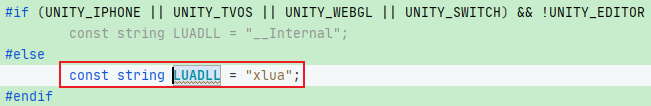


### LuaDLL.cs

统一管理lua中较为通用的基层方法(为方便调用，通常也会将该脚本命名为“LuaAPI”)：

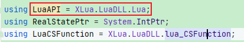

**其中的方法包含两类：**

注意：以下方法体中的参数“IntPtr L”，可以理解为虚拟堆栈，用于存储lua和其他语言交互的数据空间

#### 1.包含“xlua.dll”中的几乎所有方法：

通过“[DllImport]”标记的方式调用“xlua.dll”中所有提供的C++方法

**PS**: `CallingConvention.Cdecl`是调用C或C++的dll中的方法时默认的参数入栈顺序，暂不必深究

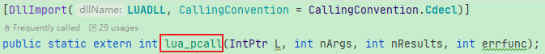

lua中原生的`lua_rawget`, `lua_rawset`:

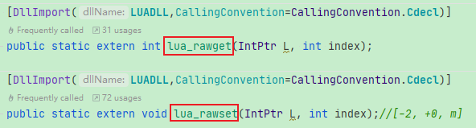

PS: 也可以根据具体需求只使用“xlua.dll”的部分方法，对于用不到的方法则不需要“dllImport”

#### 2.为了方便某些需求，在“xlua.dll”外再封装一些方法：

这些封装的方法，其方法体内部依然会调用“xlua.dll”中的方法来实现特定功能，如：

##### lua_istable:

```c#
[DllImport(LUADLL, CallingConvention = CallingConvention.Cdell)]
public static extern LuaTypes lua_type(IntPtr L, int index);

public static bool lua_istable(IntPtr L, int stackPos){
    return lua_type(L, stackPos) == LuaTypes.LUA_TTABLE;
}
```

##### lua_pop:

```c#
[DllImport(LUADLL, CallingConvention=CallingConvention.Cdell)]
public static extern void lua_settop(IntPtr L, int newTop);

public static void lua_pop(IntPtr L, int amount){
    lua_settop(L, -(amount) - 1);
}
```

##### lua_pushstring：     —— 业务逻辑使用

```c#
[DllImport(LUADLL, CallingConvention = CallingConvention.Cdell)]
public static extern void xlua_pushlstring(IntPtr L, byte[] str, int size);

public static void lua_pushstring(IntPtr L, string str){
    if(null == str){
        lua_pushnil(L);
    }
    else{
        var bytes = Encoding.UTF8.GetBytes(str);
        xlua_pushlstring(L, bytes, bytes.length);
    }
}
```

##### lua_tostring:   —— 业务逻辑使用

```c#
[DllImport(LUADLL, CallingConvention = CallingConvention.Cdell)]
public static extern IntPtr lua_tolstring(IntPtr L, int index, out IntPtr strLen);

public static string lua_tostring(IntPtr L, int index){
    IntPtr strLen;
    IntPtr str = lua_tolstring(L, index, out strLen);
    if(IntPtr.Zero == str){
        return null;
    }
    
    string ret = Marshal.PtrToStringAnsi(str, strLen.ToInt32());
    if(null != ret){
        return ret;
    }

    int len = strLen.ToInt32();
    byte[] buffer = new byte[len];
    Marshal.Copy(str, buffer, 0, len);
    return Encoding.UTF8.GetString(buffer);
}
```


### LuaEnv.cs


## 关键类型或对象工具：

### LuaBase.cs：

lua中所有对象的基类，无论是int, bool 还是object类型，在lua中都可以转换成`LuaBase`来处理

<font color=red>**每个LuaBase对象在初始化时，通过构造方法将该对象在table中key与“luaReference”绑定，lua虚拟机LuaEnv 绑定**</font>：lua虚拟机中包含有数据存储空间的堆栈`RealStatePtr L`

```lua
public LuaBase(int reference, LuaEnv luaenv)
{
	luaReference = reference;
	luaEnv = luaenv;
}
```

https://www.runoob.com/manual/lua53doc/manual.html


根据LuaBase衍生出：LuaTable.cs


### LuaTable.cs：


### ObjectTranslator.cs：


## 核心问题：

### 1.当Lua代码中执行“require xxx”时，如何自定义加载lua文件的逻辑


### 2.当调用“xxxWrap.cs”中新生成的LuaCSFunction时，获取参数的index为什么直接使用“1”，“2”？

源文件“xxx.cs”中的“MethodOne”方法：
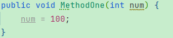

“xxxWrap.cs”中新生成的“_m_MethodOne”方法：

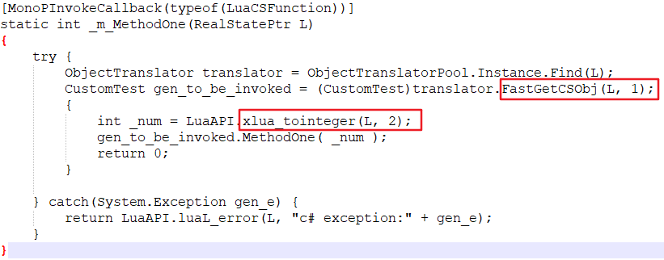

**解析：**

当向type元表中注册“xxxWrap.cs”中的方法时，这里注册的方法名是“MethodOne”，但实际方法却是新生成的“`_m_MethodOne`”，而不是“xxx.cs”源文件中的“MethodOne”

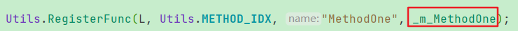

因此当在C中调用时依然可以直接使用源文件“xx.cs”中的同名方法

但实际执行时则是“`_m_MethodOne`”。

而“`_m_MethodOne`”的方法体内部：由于此时执行流程已经完全转移到C#了，因此可以自由调用C#中的方法。

根据该方法的特性(是否为static)，从“RealStateStr L”中获取C中传递过来的参数

**总结**：“`_m_MethodOne`”是为了方便C++与C#间相互调用而对C#中实际方法进行的一次封装，完全不会修改C#源文件，易于使用


#### Lua调用C#中“Static方法”与“非static方法”时，“RealStateStr L”传递参数的区别：

##### 当方法前有“static”修饰时：

源文件“xxx.cs”中的“TestStaticMethod”方法：

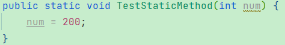

“xxxWrap.cs”中新生成的“`_m_TestStaticMethod_xlua_st_`”方法：

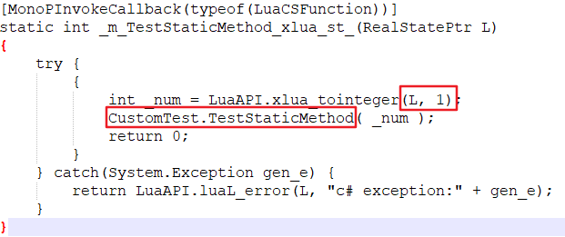

“static”代表该方法不依赖class实例而调用，因此“RealStateStr L”中也不需要传递class实例

##### 当方法前没有“static”修饰时：

源文件“xxx.cs”中的“MethodOne”方法：
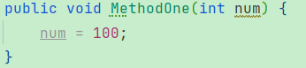

对应的“xxxWrap.cs”中的“_m_MethodOne”方法：


由于该方法需要依赖class实例而调用，因此“RealStateStr L”中包含class实例，默认在第一顺位

**总结**：

1.对于“static方法”与“非static方法”，在该脚本的“xxWrap.cs”文件中生成的“对应方法”其命名是不一样的：

非static方法：`_m_原方法名`

static方法：`_m_原方法名_xlua_st_`

2.`gen_to_be_invoked.原方法`代表会去执行源文件中的对应方法，因此该方法内部的执行逻辑依然由“源文件”自身决定


### 3."xxxWrap.cs"的作用是什么？什么时候会被加载？


### 4.如果某个C#脚本没有生成“xxxWrap.cs”，在Lua中如何加载该脚本中的变量和方法？

使用反射


## 关键特性解析：

存在的问题：

1.当需要保护元表t1，禁止外部访问元表中的方法时可以设置`__metatable`键，如`t1 = { __metatable = "hello, world"}`，那么：`__metatable`键能否使用table赋值？以上string赋值的__metatable代表什么？为什么无法访问元表中的方法？


### 普通方法：

**lua_gettop**：返回栈顶元素的索引。<font color=red>**由于栈中索引从下往上由1开始递增，因此栈顶元素的索引实际代表栈中当前元素数量**</font>；栈顶元素索引为0则代表当前栈中没有元素

**lua_settop**：设置栈顶元素索引，当设置为0时则栈会被清空；当数值大于当前栈中元素个数时，新增的元素赋值为nil

**PS:** 栈中索引取值范围“1 ~ n”，<font color=red>**默认从栈底为1，栈顶为n**</font>；但是<font color=red>**也可以从栈顶反向开始，但需使用负值，此时栈顶为“-1”，栈底为“-n”**</font>

**lua_pop：**从栈中弹出n个元素，如`lua_pop(lua_State *L, int n)` 

**lua_getglobal：**如`lua_getglobal(*L, "abc")`，将全局变量“abc”的value压入栈L中。PS: 方法体声明为`int lua_getglobal(lua_State *L, const char *name)`

**lua_setglobal**：`lua_setglobal(L, "abc")`，将栈顶元素出栈，并作为全局变量“abc”的value

**lua_remove**：`lua_remove(L, int index)`，<font color=red>**移除栈L中指定索引index的元素，并将栈中排列在index之上所有的元素都移下来填补该空位**</font>

**lua_pushvalue**: `void lua_pushvalue(L, int index)`，为栈中指定索引处的元素生成副本，并将该副本入栈(作为新的栈顶元素)

**lua_type**：`int lua_type(L, int index)`，返回栈L中给定索引处的值类型，有LUA_TNIL/TNUMBER/TSTRING/TBOOLEAN/TTABLE等类型

```c#
if(LuaAPI.lua_type(L, idx) == LuaTypes.LUA_TSTRING){
    return LuaAPI.lua_tobytes(L, idx);
}
```

**lua_topointer**：`IntPtr lua_topoint(L, int index)`，将指定index处的值转换成C语言中的指针(指针中存放的是该值的地址)。通常在调试信息时使用，如获取lua值的HashCode：

```c#
public override int GetHashCode()
{
    //根据当前元素LuaBase的key值获取到其value，并压入栈L中
    LuaAPI.lua_getref(luaEnv.L, luaReference);  
    //将指定索引处的值转换成一般的C指针
    var pointer = LuaAPI.lua_topointer(luaEnv.L, -1);  
    //栈顶元素出栈，栈L恢复原样
    LuaAPI.lua_pop(luaEnv.L, 1);  
    return pointer.ToInt32();
}
```

**lua_checkstack**: `bool lua_checkstack(L, int extra)`，确保堆栈上至少有“extra”个空位。如果堆栈当前空位不满足则将其扩展，否则保持不变。该函数只会将栈L空间增大或保持不变，不可能减少栈空间。默认返回true，只有在扩展栈空间失败时才会返回false


#### PS：`lua_tointeger` 和 `lua_tonumber` 的区别

`lua_tointeger`：<font color=blue>**要求给定index处的lua值为整数**</font>，并且该方法返回值类型为`lua_Integer`(“xlua.dll”中封装的数据类型)

`lua_tonumber`：<font color=blue>**要求给定index处的lua值为数字(不一定是整数)**</font>，并且该方法返回值类型是`lua_Number`("xlua.dll"中封装的数据类型)


### <font size=5>重点方法</font>：

#### <font color=red size=5>**lua_loadbuffer**</font>

作用与**lua_load**相同，<font color=red>**都是加载一段lua代码块，但不运行它**</font>，其他类似的方法有`lua_loadbufferx`。<font color=red>**如果执行中没有报错，则会把该代码块作为一个lua函数压入栈中，否则压入错误信息**</font>：

`int lua_load(L, lua_Reader reader, data, chunkname, mode)`

<font color=blue>**参数解析：**</font>

**reader**：`lua_load`可以使用用户自定义的reader函数来读取lua代码块

**data**：代码块数据，可以直接为脚本中的原生string代码，也可以将脚本string代码转换成byte[]数组格式。<font color=red>**`lua_load`会自动根据data为string或byte[]形式，执行不同的加载操作**</font>

**chunkname**：为该代码块设置name，在执行异常时会作为调试信息在error_func中处理，以方便查询

`lua_load/loadbuffer/loadbufferx`函数返回结果：

- LUA_OK：数值为0， 代表没有错误
- LUA_ERRSYNTAX：在预编译时碰到语法错误
- LUA_ERRMEM：内存分配错误
- LUA_ERRGCMM：在运行`__gc`元方法时出错

<font color=red>**通常结合lua_pcall使用，在使用lua_load加载完一段lua代码块后，使用lua_pcall执行该lua函数**</font>


#### <font color=red size=5>**lua_pcall**</font>

`int lua_pcall(*L, int nargs, int nresults, int msgh)`

<font color=blue>**作用**</font>：与`lua_call`效果相同，都是执行栈L中的一段lua函数，执行完毕后都会将该lua函数以及用到的参数从栈中移除，并将lua函数执行结果压入栈中

<font color=blue>**执行过程**</font>：

1.先将lua函数压入栈中

2.将该lua函数需要用到的参数按顺序依次压入栈中，按照方法体中的参数顺序，第一个参数先压入栈

3.<font color=red>**执行完毕后将lua函数以及所有用到的参数都出栈**</font>，并将lua函数返回值(如果有)按照顺序依次压入栈，第一个返回值先入栈

执行完毕后，<font color=red>**栈L中依次存放lua函数返回值，第一个返回值先入栈，因此此时栈顶元素为lua函数最后一个返回值**</font>

<font color=blue>**“lua_pcall”与“lua_call”的区别**</font>：

1.`lua_pcall`会捕获执行过程中的异常信息，并将错误信息经过`error_func`处理后压入栈中，而`lua_call`则不会处理异常信息

2.`lua_pcall`有返回值LUA_OK/ERRRUN等：`int lua_pcall(L, int args, int nresults, int msgh)` 

而`lua_call`没有: `void lua_call(L, int nargs, int nresults)`

`lua_pcall`的返回值：

- LUA_OK：数值为0，代表执行成功
- LUA_ERRRUN：运行时错误
- LUA_ERRMEM：内存分配错误
- LUA_ERRERR：在运行错误处理函数`error_func`时发生错误
- LUA_ERRGCMM：在运行`__gc`元方法时发生错误

<font color=blue>**参数解析：**</font>

**nargs**：lua函数需要的参数个数，需要按顺序依次压入栈中，即第一个参数先压入栈

**nresults**：lua函数执行完毕后只将函数返回值的前nresults个压入栈中，不足的个数用nil代替。

<font color=red>**但当`nresults = LUA_MULTRET`，即`nresults = -1`时，默认将lua函数所有返回值压入栈**</font>。返回值依然按照顺序依次入栈，第一个返回值先入栈，因此执行结束后，栈顶为函数的最后一个返回值

**msgh**：用于处理`lua_pcall`执行时出现的异常：<font color=blue>**当数值为0时**</font>代表无需对错误信息进行处理，直接将原始错误信息压入栈L中；<font color=blue>**当数值不为0时**</font>，<font color=red>**该数值代表错误处理函数`error_func`在栈L中的索引地址**</font>。如果执行中出现异常，<font color=red>**则会将错误信息作为参数传入`error_func`函数中，经过处理后将`error_func`函数的返回值压入栈中**</font>

**PS**：`error_func`函数会将错误信息作为参数传入，并添加栈跟踪等更多调试信息，之后将结果作为函数返回值压入栈L中

<font color=blue>**实际案例：**</font>

Lua代码：

```lua
a = f("how", t.x, 14)        -- 这里"a", "f"都是全局变量，而非local变量
```

该代码编译后的实现逻辑为：

```c#
lua_getglobal(L, "f");    //将lua函数压入栈中

//将第一个参数压入栈
lua_pushstring(L, "how");   

//第二个参数入栈
lua_getglobal(L, "t");       //将全局变量t的值压入栈
lua_getfield(L, -1, "x");    //获取t的值中key为“x”的元素的value，并将该value压入栈
//为了保证lua_call中参数的严格索引顺序，必须移除栈中“t”。由于“t.x”的value被压入栈中，因此“t”的索引变为“-2”
lua_remove(L, -2);    

//第三个参数入栈
lua_pushnumber(L, 14);

//执行lua_call，或lua_pcall
lua_call(L, 3, 1);
//lua_pcall(L, 3, 1, 0);         

//由参数可知，该函数只有一个返回值压入栈中，按照顺序是lua函数的第一个返回值被压入栈
lua_setglobal(L, "a");  //将栈顶元素出栈，作为全局变量“a”的value
```

**解析：**

1.从以上`lua_call/lua_pcall`执行流程可知：由于调用`lua_call/lua_pcall`时并没有说明lua函数在栈L中的具体索引，所以可以判定**lua函数在栈中的索引**与**参数在栈中的索引**必然是紧密连接的

这也是`lua_load` 与 `lua_pcall`通常配套执行的原因

2.以上代码执行完毕后，栈L恢复如初，所有执行该lua函数相关的内容都已出栈，包含返回值。因此栈L又恢复成原有配置，如此方便执行后续操作

3.以上`lua_getglobal, lua_pushstring, lua_setglobal`等所有lua方法，<font color=red>**最终都会通过`“[DllImport]”`的方式执行`xlua.dll`中的C代码**</font>


#### <font color=red>lua_pushstdcallcfunction</font>

**使用方式**：`void lua_pushstdcallcfunction(IntPtr L, LuaCSFunction function, int n = 0)`

**解析**：如下图所示

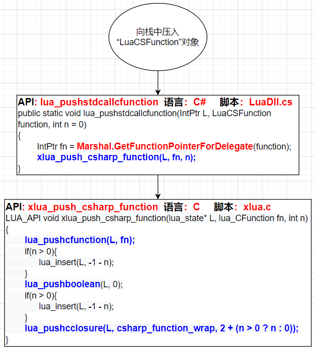

##### Marshal.GetFunctionPointerForDelegate(LuaCSFunction function)：

在C#脚本中，为C#委托方法生成指针“IntPtr”

##### lua_pushcfunction：

在C脚本中将一个C函数压入栈中，相当于`lua_pushcclosure(L, fn, 0)`

##### lua_pushcclosure：

在C脚本中，将一个C函数压入栈中，参数n指代与该函数相关联的参数个数。

**注意：**

1.当n为0时代表被压入的函数没有关联值，此时是一个轻量C函数

当n > 0时，则需要**<font color=red>首先</font>**将n个参数按顺序依次入栈(第一个参数先入栈)，**<font color=red>之后</font>**使用lua_pushcclosure将**<font color=red>C函数</font>**入栈，如此形成C闭包。

但调用lua_pushcclosure后，**<font color=red>之前入栈的n个参数则会出栈</font>**，此时栈中只有闭包自身

任何时候调用该C函数时，**<font color=blue>都会根据n的个数依次从相应索引处获取参数值</font>**

2.C函数和相应的参数组成闭包，任何时候该C函数都可以访问到索引处的参数值

3.**<font color=blue>如果某个C函数没有相关联的参数则可以直接使用lua_pushcfunction，否则需要使用lua_pushcclosure形成包含关联参数的C闭包</font>**

**<font color=red>并且关联的参数类型不限，即与该C函数相关联的参数也可以是一个C函数</font>**

```c#
public void Push(RealStatePtr L, LuaCSFunction o)
{
	if (Utils.IsStaticPInvokeCSFunction(o))
	{
		LuaAPI.lua_pushstdcallcfunction(L, o);
	}
	else
	{
		Push(L, (object)o);
		LuaAPI.lua_pushstdcallcfunction(L, metaFunctions.StaticCSFunctionWraper, 1);
	}
}
```

**4.获取与该C函数关联的参数的值**：

`xlua_upvalueindex(int n)`：n代表与该C函数关联的第几个参数(按照参数列表的顺序依次从左往右)

```c#
[MonoPInvokeCallback(typeof(LuaCSFunction))]
static int StaticCSFunction(RealStatePtr L)
{
	ObjectTranslator translator = ObjectTranslatorPool.Instance.Find(L);
	LuaCSFunction func = (LuaCSFunction)translator.FastGetCSObj(L, LuaAPI.xlua_upvalueindex(1));
	return func(L);
}
```

5.**这里与`lua_pcall`的重要区别在于**：`lua_pcall`是**<font color=blue>先压入lua函数，后压入该函数执行需要用到的参数</font>**，而闭包`lua_pushcclosure`则是**<font color=blue>先压入该C函数需要用到的参数，然后再压入该C函数</font>**。


#### <font color=red>luaL_ref</font>

**使用方式**：`int luaL_ref(L, int index)`

**解析**：Lua中每一个LuaBase对象都有一个唯一的key，即LuaBase.reference。luaL_ref的作用在于为特定对象，在指定index的table中生成唯一的key，并将该key作为方法的返回值

**执行过程**：

1.将栈顶元素“topElement”出栈

2.在栈L指定index处的`table`中，为该元素“topElement”生成唯一的key。该key是一个整数键(根据table中默认算法自动生成，类似于事件ID生成器那种)，即`table[key] = topElement`

3.将该key作为函数返回值(如果topElement元素为nil，则返回常量`LUA_REFNIL`)

<font color=red>**注意：**</font>

`luaL_ref`默认会为当前栈顶对象生成key，并且将栈顶对象出栈。<font color=blue>**所以如果需要为特定参数生成key，则需要首先将该参数入栈，再调用`luaL_ref`函数**</font>：

<font color=red>**如果该元素当前已在栈中(不一定在栈顶)**</font>，<font color=blue>**如果只是为了获取key，而不想改变栈L原有配置**</font>，则需要调用`lua_pushvalue`方法：`void lua_pushvalue(L, int index)`， 为栈上给定索引处的元素<font color=red>**生成副本，并将该副本入栈**</font>


#### lua_newtable, lua_createtable, luaL_newmetatable, luaL_getmetatable

**`lua_newtable`:** 创建一张新的空表入栈，相当于`lua_createtable(L, 0, 0)`

**`lua_createtable`**: `void lua_createtable(L, int narr, int nrec)`

创建一个新的空表入栈。参数narr, nrec分别代表栈中预分配的元素数量，则空表的元素数量“>= narr + nrec”。由于预分配可以提高性能，因此在调用“lua_createtable”时如果能够预先知道元素的数量，则应尽量设置“narr”或“nrec”参数数值(不设置也不会报错)

**`luaL_newmetatable`**: `int luaL_newmetatable(L, string name)`

创建一张新表入栈

**与`lua_newtable, lua_createtable`不同的是**：**<font color=red>会在注册表中为该新表设置键值对，key为参数name，即`RegistryTable[name] = newtable`</font>**

**`luaL_getmetatable`**: 与rawget作用相同，将注册表中指定key的value入栈


#### lua_rawget, lua_rawgeti, lua_gettable, lua_getfield, lua_rawset, lua_rawseti, lua_settable, lua_setfield, lua_next

##### <font color=red size=5>**lua_rawget, lua_gettable：**</font>

**定义**：

`lua_gettable`：获取栈中指定索引处的table(触发元方法__index)，获取栈顶元素作为key。在table中查找指定key的元素，并将该元素的value值入栈(先将key出栈，然后将table[key]入栈，替代原来的栈顶元素key)

**如果table中没有该key**，<font color=red>**则压nil入栈，并返回LUA_TNONE**</font>;

**如果table中有该key，但没有value**，<font color=red>**则压nil入栈，并返回LUA_TNIL**</font>;

**如果table有该key以及value**，则将value入栈，并返回value的值类型

`lua_rawget`：用法同lua_gettable，但是当key不存在时不会触发元方法`__index`

**用途**：本质上讲就是获取table中key对应的value值，最直接的使用案例是遍历table中元素

```c#
//当table中key为确定已知数值时
int size = lua_objlen(L, -1);     //获取栈顶元素table的长度，相当于#table
for(int i = 1; i <= size; ++i){
    lua_pushnumber(L, i);         //将目标key入栈，成为当前L栈顶元素
    lua_gettable(L, -2);          //由于有新元素入栈，因此table的索引变为“-2”
    //由于“lua_gettable”方法已经table[key]入栈，所以这里为了下次遍历方便，将当前栈顶元素出栈
    lua_pop(L, 1);                
}
```

**注意：**

1.`lua_gettable(*L, index)`<font color=red>**并不能独立存在，必然结合当前栈顶元素作为key，两者联合才能使用**</font>。从本质上讲`lua_gettable(*L, index)`只是获取当前栈L中索引“index”的table

2.`lua_gettable(*L, index)`<font color=red>**内部执行逻辑：**</font>

第一步：获取当前栈L指定index处的table(该操作会触发元方法`__index`)

第二步：先将当前栈L的栈顶元素<font color=red>**出栈**</font>，并将该数值作为key，即 key = lua_pop(L, 1)

第三步：去table中查找key值匹配的元素，并将对应的value值`table[key]`<font color=red>**压入栈L**</font>中

3.上述代码中为了方便遍历，会在每次遍历前压入目标key值以方便lua_gettable调用，同时在遍历后将当前table[key]出栈，以确保下次调用lua_gettable时，table在栈L中的索引依然为“-2”

**PS:** "xlua.dll"额外定义了一个方法：`xlua_pgettable`

```c#
[DllImport(LUADLL, CallingConvention = CallingConvention.Cdell)]
public static extern int xlua_pgettable(IntPtr L, int idx)
```

`xlua_pgettable`同样是以当前栈顶元素为key，获取指定“idx”的table该key对应的数值。**区别在于函数的返回值意义不同**：

`xlua_pgettable`：如果执行正常则返回0，否则返回错误码

`lua_gettable`：如果执行正常则返回value的值类型lua_type，当值为nil也会被入栈，并返回类型LUA_TNIL —— -1

<font color=blue>**PS: C语言文件"lua.h"中定义的lua_type: LUA_TNIL - “-1”, LUA_TOK - “0”, LUA_TBOOLEAN - “1”**</font>


##### <font color=red size=5>**lua_rawset, lua_settable：**</font>

**定义：**

`lua_settable`：设置指定index处的table(触发元方法`__newindex`)中的元素

`lua_rawset`：用法同lua_settable，但当key不存在时不会触发元方法`__newindex`

**用途：**<font color=red>**将当前栈L中index = -1的元素出栈并作为value，index = -2的元素出栈并作为key，获取lua_settable(*L, index)中index所指向的table，为该table设置元素：table[key] = value**</font>

```c#
lua_getglobal(L, "mytable"); //将全局变量“mytable”对应的值value压入栈L，并返回value的类型
lua_pushnumber(L, 1);    
lua_pushstring(L, "abc");
lua_settable(L, -3); //此时mytable的index变成-3
```

**解析**：

1.<font color=red>**lua_settable内部执行逻辑中会将当前L的“index = -1”和“index = -2”的元素都出栈**</font>

2.lua_settable在执行前需要将key, value事先压入栈L中，之后才能调用lua_settable，此时table对应的index为“-3”


##### <font color=red size=5>**lua_rawgeti, lua_getfield**</font>：

基于`lua_rawget, lua_gettable`的进化版本，分别在key为数值键`lua_rawgeti`和字符串键`lua_getfield`时使用

```c#
//lua_gettable，lua_rawget版本：
lua_getglobal(L, "myTable");
if(typeof(key) == LuaType.LUA_TNUMBER){
    //当key为数值键时
    lua_pushnumber(L, key);
}
else if(typeof(key) == LuaType.LUA_TSTRING){
    //当key为字符串键时
    lua_pushstring(L, key);
}
lua_gettable(L, -2);

//以上可以使用lua_rawgeti, lua_getfield来简化：
lua_getglobal(L, "myTable");
if(typeof(key) == LuaType.LUA_TNUMBER){
    //当key为数值键时
    lua_rawgeti(L, -1, key);
}
else if(typeof(key) == LuaType.LUA_TSTRING){
    //当key为字符串键时
    lua_getfield(L, -1, key);
}
```

**解析**：<font color=red>**lua_rawgeti相当于将key作为方法体中的参数传入，这样无需再往栈中压入key值，因此“table”的索引也与“lua_rawget”有所不同，对应“-1”即可**</font>


##### <font color=red size=5>**lua_rawseti, lua_setfield**</font>:

`lua_rawset，lua_settable`的简化版本，根据key的类型分别使用lua_rawseti(数值键)和lua_setfield(字符串键)

```c#
lua_getglobal(L, "myTable");
if(typeof(key) == "数值键"){
    lua_pushnumber(L, key);
}
else if(typeof(key) == "字符串键"){
    lua_pushstring(L, key);
}
lua_pushstring(L, value);  
lua_settable(L, -3);

//进化版本：
lua_getglobal(L, "myTable");
lua_pushstring(L, value);
if(typeof(key) == "数值键"){
    lua_rawseti(L, -2, key);
}
else if(typeof(key) == "字符串键"){
    lua_setfield(L, -2, key);
}
```

**注意：**

1.当向栈L中压入元素时，需要根据元素的类型选择`lua_pushnumber, lua_pushstring`等，由于以上主要为了区分`lua_rawseti, lua_setfield`在key为数值键和字符串键的区别，不区分value的情况，因此只使用lua_pushstring

2.`lua_rawseti`和`lua_rawgeti`类似，也是将key作为方法体中的参数传入，并不需要在栈L中重新压入key

参考链接：https://blog.51cto.com/u_15357029/3777520

https://www.cnblogs.com/chuanwei-zhang/p/4077247.html


##### <font color=red size=5>**lua_next**</font>

依次获取table中的元素，常用于遍历table时使用

如：`lua_next(L, index)`

第一步：获取栈L中指定index所对应的table(触发元方法`_index`)

第二步：<font color=red>**将当前栈顶元素出栈**</font>，作为<font color=red>**上一次**</font>遍历时的key。lua_next方法体内部会根据该key自动计算出table中紧接着的下一个key值，**并压入栈中**

(1.查找下一个key的执行逻辑已封装，暂时查询不到 2.如果上一个key为nil，则代表当前遍历的为table中第一个元素。lua_next会自动选择一个key)

第三步：**根据计算出来的key值去table中查找，将key对应的value也压入栈L中**，**<font color=red>并返回非0数值</font>**(当lua_next返回值为0时则代表没有下一个key，此时遍历结束)。此时lua_next执行完毕

```c#
lua_pushnil(L);      //将nil压入栈中
while(lua_next(L, index) != 0){
    //1.lua_next在第一次遍历时由于当前栈顶元素为nil，说明是table中第一次遍历，此时自动选择key值
    //2.每次lua_next执行完毕后，key和value都已压入栈L中，因此栈中的顺序为：
    //  index: -1 —— value, -2 —— key, -3 —— table
    //  PS: 由于table是通过元方法来获取到的，因此table并严格要求为"-3"
    //3.为了方便下次遍历，在lua_next执行完毕后将value出栈，这样key则成为栈顶元素
    //  在下次调用lua_next时，此key则作为上次遍历的key值被出栈来使用，
    //  lua_next方法体内部则会根据该key值计算出本次遍历的key，如此循环
    lua_pop(L, 1);
}
```

参考链接：https://www.cnblogs.com/chuanwei-zhang/p/4077247.html


### 混淆视听的方法：

#### lua_getref

<font color=red>**完全与`luaL_ref`完全无关**</font>，是“LuaDll.cs”中一个自定义方法，<font color=red>**其作用与lua_rawgeti相同**</font>，只是省却了table的索引参数(**一律使用默认的索引"LUA_REGISTRYINDEX"**)，因此可以简化代码，方便调用。方法体内容如下：

```c#
public static void lua_getref(IntPtr L, int reference)
{
    xlua_rawgeti(L,LuaIndexes.LUA_REGISTRYINDEX,reference);
}
```

#### `luaL_getmetatable`：

与rawget作用相同，与metatable特性基本无关，命名有装逼混淆的嫌疑

```c#
public static void luaL_getmetatable(IntPtr L, string meta){
    xlua_pushasciistring(L, meta);
    lua_rawget(L, LuaIndexes.LUA_REGISTRYINDEX);
}
```

描述：虽然名字是“getmetatable”获取元表，但本质上只是在注册表中获取指定key的value值而已，和普通的查找元素值并没有区别。

只是传递过来的参数“meta”通常代表的是某一类型数据的基类，类似于C#中的抽象基类。根据作用来区分，故将其命名为“元表”，实际和普通的key没什么区别


## 注册表：

注册表在栈L中的索引为“LuaIndexes.LUA_REGISTRYINDEX”

注册表中的内容：

1.所有类型的命名空间路径配置总表：整个项目只有一个

KEY：LuaEnv.CSHARP_NAMESPACE，即“xlua_csharp_namespace”

VALUE: table类型

存放所有type的路径分布，类似于多叉树，层层递进，最终叶子存放的是该classname的table值

并且该table中除了一个总的命名空间层层递进表外，还为每个type单独设置键值对，方便直接查找该type的value

详细可查看`Utils.SetCSTable`


2.各个type的元表：

这里分成两种：一种是该type的static的class元表，另一种是该type的所有实例对象的原表。主要是因为type脚本中部分参数是static类型，部分则需要依赖实例对象而使用，并不是该class自带的

KEY: typename, string形式

VALUE: 


2.各个Type

KEY: Type.fullName，即各个脚本类型的全名

VALUE：


**PS:** 

1.**入栈**：将元素压入栈时都需要使用"xlua.dll"中提供的方法，从方法体的参数声明来看，该参数类型都只能是C语言中可以接受的类型。

对于“LuaCSFunction”类型的参数则需要将其转换成指针类型来使用


**出栈**：从栈L中获取到的元素，如lua_type(L, index) 获取指定索引处的元素值类型，则需要使用“LuaTypes.LUA_TSTRING”等“lua.h”中专门定义的类型：

```c#
[DllImport(LUADLL)]
public static extern LuaTypes lua_type(IntPtr L, int index)
```


**Lua中部分常量定义** https://www.lua.org/source/5.3/lua.h.html

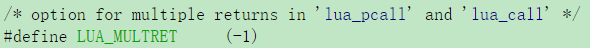


