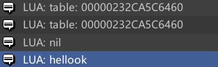

[TOC]


# 元表和元方法：

## 元表：

元表本质上就是一个普通的table，但专用于对一些特殊方法做定义，以此作为普通table的补充。当对table执行这些特殊操作时，则会触发元表中定义的这些方法，而这些特殊方法则被称为“元方法”

注意：

1.Lua中**<font color=red>除LUA_TTABLE/LUA_TUSERDATA外</font>**的数据类型默认都有元表，该元表根据不同的lua_type而区分，如LUA_TBOOLEAN, LUA_TNUMBER等都具有不同的元表，

而LUA_TTABLE/TUSERDATA类型的数据，则需要手动设定元表。默认在创建table时是不会为该table设置元表的

2.table的元表可以是自身，也可以是其他任意table。<font color=red>**元表体现的是一类table共有的特性**</font>，如多种操作符、查找表中元素等行为


### 相关的API：

#### 只能在Lua语言中直接使用的：

`setmetatable`: 设置元表`setmetatable(t1, t2)`，将t2作为t1的元表

PS：由于无法使用lua代码为LUA_TBOOLEAN/TNUMBER等数据类型设置元表，因此`setmetatable`中参数“t1”需要为LUA_TTABLE类型

`getmetatable`: 获取元表getmetatable(obj)，可以获取lua中任意数据类型的元表。

```lua
local a = "hello"
local b = "ok"
local c = { 1, 2, 3}
print(getmetatable(a))
print(getmetatable(b))
print(getmetatable(c))
print(a..b)
```

输出结果：



从输出结果可知：LUA_TSTRING等数据类型确实有默认的元表，因此可以进行“..”拼接操作，而LUA_TTABLE类型默认没有元表，需要手动赋值


#### 只能在C#中直接使用的：

这些metatable相关的方法是在C#中使用的，有的是直接对应C语言中的同名方法，有的是在C#中另外封装的：

##### 对应C语言中同名方法：

###### `lua_newtable:`

创建一个普通的table，其本质相当于lua_createtable(L, 0, 0)

###### `lua_createtable`:

```c#
[DllImport(LUADLL)]
public static extern void lua_createtable(IntPtr L, int narr, int nrec)
```

创建一个空表，并根据参数narr, nrec为表进行预分配(只有在创建该table前已知需要将该table用作某些用途，已知表中必然需要具备的元素个数时才有效)

narr，nrec：基本都表示大概拥有元素的个数，区别可查询API文档

总结：这个方法其实很鸡肋，效果和lua_newtable基本一样，只是如果预先知道表中需要拥有的元素则可以提前分配，<font color=red>**而预分配是可以提高性能的—— 这才是本方法存在的根本原因**</font>

###### `luaL_newmetatable`： 

```c#
[DllImport(LUADLL, CallingConvention = CallingConvention.Cdell)]
public static extern int luaL_newmetatable(IntPtr L, string meta)
```

描述：创建一个新表table，并将该table压入栈，同时在注册表中根据参数“meta”为该table设置键值对：

```
REGISTRYTABLE[meta] = table
```

这和普通的“`rawset(L, index, key)`”设置键值对没什么不同，唯一的特殊在于：该key —— meta对应的value是用来作为某一类型数据的元表使用的，因此命名为“meta”，并为该效果专门定制API: `luaL_newmetatable`

PS: 该方法与“`lua_newtable`”本质上并无区别，只是根据创建的table的具体用途有所区分，而`lua_newtable`由于只是简单的创建一个空table，并不需要在注册表中为其生成键值队

```c#
public static void lua_newtable(IntPtr L){
    lua_createtable(L, 0, 0);
}

[DllImport(LUADLL, CallingConvention = CallingConvention.Cdell)]
public static extern void lua_createtable(IntPtr L,int narr, int nrec)
```

###### `lua_setmetatable`:

```c#
[DllImport(LUADLL)]
public static extern int lua_setmetatable(IntPtr L, int objIndex)
```

将当前栈顶元素**出栈**，作为指定objIndex索引处的元素的元表


###### C#中自定义封装的方法

`luaL_getmetatable`：与rawget作用相同，获取指定key的value。由于该value的实际作用是metatable，故命名偏向于此


## 元方法：

### 多种操作符对应的元方法：

该元方法会在使用相应的操作符时自动触发

算术操作符如加减乘除等

| 操作符 | 元方法 |
| :----: | :----: |
|   +    | __add  |
|   -    | __sub  |
|   *    | __mul  |
|   %    | __mod  |
|   /    | __div  |

关系操作符如">, <, =="

| 操作符 | 元方法 |
| :----: | :----: |
|   ==   |  __eq  |
|   <    |  __lt  |
|   <=   |  __le  |

其他常用操作符：

| 操作符 |  元方法  |
| :----: | :------: |
|   #    |  __len   |
|   ..   | __concat |

### 部分特殊元方法

#### `__tostring`

触发方式：将lua中任意对象转换成LUA_TSTRING类型时自动触发

```lua
local t = {1, 2, 3}
print(t)    -- 此时会自动触发元方法“__tostring”
```

注意：元方法只有在元表中才有效，如下形式只会被认为是某个同名方法，并不会被自动调用

```lua
local t = {1, 2, 3}
t.__tostring = function()
    return "yeah"
end

print(t)    
-- 虽然“__tostring”与元方法同名，但由于并不在元表中，因此并不会被调用
```

为解决以上情况，有两种方案：

方案一：使用setmetatable设置元表

```lua
local t = {1, 2, 3}
setmetatable(t, { __tostring = function()
            return "yeah"
        end})

print(t)   -- 此时调用元表中的元方法“__tostring”
```

方案二：设置自身为元表

```lua
local t = {1, 2, 3}
t.__tostring = function()
    return "yeah"
end

setmetatable(t, t)
print(t)
```


#### `__index`

触发方式：跨表查询指定key的value值时自动触发。查找某个table是否有元表也是通过`__index`来查找：如果该`table.__index`为nil，则代表该table没有元表

查询表中元素过程：

1. 检测table中是否有键key，若有则直接返回table[key]；若没有，则进行第2步
2. 检测table是否有metatable，若有，则进行第3步；若没有，则返回nil
3. 检测该metatable中是否有`__index`元方法，若没有，则直接返回nil；若有，若`__index`对应的是table，则在该table中查找key；若`__index`对应的是方法，则直接执行该方法

当本table中没有目标元素时，则先检测该table是否有元表，如果有则去其元表中查找，但也不是直接去元表查找，而是通过该元表的`__index`的指向来查找(通常设置元表的`__index`为自身，以方便查找；如果元表的__index指向其他的表，则去其他的表中查找，而不会在元表中查找)：

```lua
father = {house = 1}
son = {car = 2}
setmetatable(son, father)

print(son.house)
```

执行结果为：

将以上代码修改为：

```lua
father = {house = 1}
father.__index = father
son = {car = 2}
setmetatable(son, father)

print(son.house.."    @@@@@@ value ")
```

执行结果为：


**注意：**

1.<font color=red>**当table自身包含该key时并不会触发元方法`__index`**</font>，只有在table中没有该key，才会去元表中查找；<font color=red>**而在元表中查找元素只能通过`__index`的方式，而不能直接在metatable中查找key**</font>

2.metatable中的元方法__index可以指向自身，也可以指向其他任意table，也可以是方法

3.`__metatable`代表“保护元表”，**<font color=red>虽然其名字与元表有关，但通过该元方法无法获取到该table的元表，只有通过该`table.__index`才可以</font>**


##### Lua中表的继承的实现：

在Lua中实现各个table之间的继承即是通过“Setmetable”以及“`__index`”来达到。

```lua
function class(classname, super)  
    local superType = type(super)  
    local cls  
  
    if superType ~= "table" then 
        return nil
    end  
    
    if super then  
        cls = {}  
        setmetatable(cls, {__index = super})  
        cls.super = super  
    end  

    cls.__cname = classname  
    cls.__ctype = 2 -- lua  
    cls.__index = cls  

    function cls.new(...)  
        local instance = setmetatable({}, cls)  
        instance.class = cls  
        instance:ctor(...)  
        return instance  
    end  

    return cls
end
```


#### __newindex

触发方式：当为table中某个新的key赋值时自动触发，如`table[key] = value`，当table中并没有指定的key时，此时自动触发元方法`__newindex`


#### __metatable

保护元表。当需要对外部隐藏某个表的元表时，则可使用该键(当前暂存一定疑惑，但大体作用如此，可以再研究下)


### **避坑指南：**

1.当对lua中任意数值执行某些特殊操作时，会自动调用该数值对应的元方法，<font color=red>**但元方法必须存在于元表中才有效**</font>。如果该数值没有元表，则必然不会调用该元方法。

但元方法`__len`不依赖于元表来执行：

```
local t = {1, 2, 3}
print(getmetatable(t))
print(#t)     -- 触发元方法“__len”
```

输出结果：


