[TOC]


## LayoutGroup

LayoutGroup组件中各个参数的实际作用：
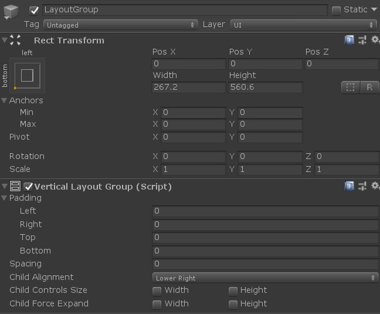

### Transform：

- Anchor: 这里设定LayoutGroup的“Anchors”其实对LayoutGroup本身并不会太大改变，“Anchor”本身的作用在于调整子对象与父对象之间的对齐方式 —— 尤其是在父对象的size发生改变时。如果父对象的size始终不会发生变化，那么设定子对象的Anchor其实并没有太大的作用
- Pivot：每一个对象都有相应的size，那么pivot设置的是这个对象在展开size时的基准点，size中的width和height都根据此pivot来展开 —— 所以这也注定了pivot并非是整个物体展示区域的正中心，但整个物体的展示区域是根据此pivot来拉伸开的

### LayoutGroup：

- **Padding:**  LayoutGroup自身的transform会设置该物体所占用的width/height —— <b><font color=red>区域A</font></b>，在绘制该LayoutGroup下的item列表时，所以item所占用的size也会有一个整体的width/height —— <b><font color=red>区域B</font></b>。那么“Padding”设置的则是这两个size区域之间的sizeDelta

- <b><font color=blue>Spacing:</font></b>  设定每个item之间的间隔，如果是horizontal布局，则代表每个item水平方向的间隔；如果是vertical布局，则代表垂直方向上的间隔

  <font color=red>**但需要注意的是：**</font>在以上“VerticalLayoutGroup”中开启“child force expand”中“height”，那么item之间垂直方向的间隔不受“Spacing”影响。item之间的间隔会根据每个item的height, 所有item可以绘制的总height来最终计算出每个item之间实际的“ySpacing” —— 整个计算过程是LayoutGroup自动执行的

- <b><font color=blue>Child Alignment: </font></b>在<b><font color=red>区域B</font></b>内绘制item时，首先有三点需要明确：

  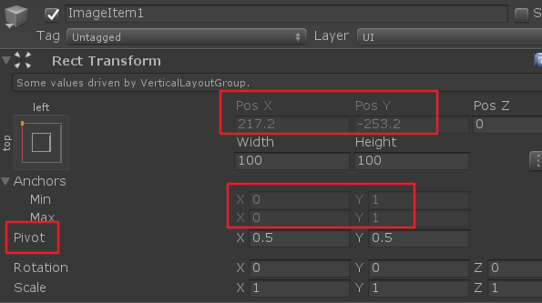

  1. item的绘制顺序：<b><font color=red>严格按照Hierarchy中从上往下的顺序依次绘制，并且以区域B的左上角为起点。所以可以肯定的是：item1一定展示在item2的上面，即item1.yPos > item2.yPos</font></b>
  2. 每个item的anchor： <b><font color=red>这个属性无论如何更改VerticalLayoutGroup中的public参数都无法改变</font></b>，事实上anchor设置的是父子对象之间的sizeDelta —— 即适配关系，如果父对象size始终不变，那么则没有实际用处。
  3. item的pivot： 这里是支持自定义每个item的pivot的，也就是可以自由item的size区域拉伸的基准点。同时可以明确的是：pivot所在的位置即是transform的position/localPostion

  - <b><font color=red>区域B</font></b>内<b><font color=blue>item列表的绘制顺序：</font></b>

    **<font color=red>1)</font>**根据Hierarchy中从上往下的顺序，以<b><font color=red>区域B</font></b>左上角为起点，默认item1.localPostion = Vector2.zero

    **<font color=red>2)</font>**获取LayoutGroup中"Child Alignment"，例如当child alignment = ”Upper Left“时，此时item1.localPosition = Vector2.zero；如果child alignment = "Lower Left"时，则需要根据所有item的整体位置自动调整item1的localPosition。

    **核心**：**<font color=red>只有在区域B的width/height超出item对应的width/height时</font>**，调整child alignment才能看到实际的效果。如果<b><font color=red>区域B</font></b>太小不足以显示单个item整体的size，那么无论如何调整child alignment都是看不到效果的

    **<font color=blue>PS: </font>**

    **<font color=blue>1.当添加content size fitter组件时，由于width/height都设置为preferred height/widht，所以调整child alignment后是不会看到变化的</font>**

    2.根据child alignment获取到item的最终位置，然后根据item自身的pivot调整显示在transform中的position数值 —— 这一步是根据item自身的pivot自动调整的。在区域B的整体item位置分布上没有影响

    <b><font color=red>总结：child alignment调整的是当item的size超出区域B的width/height时的对齐方式。当区域B过小，不足以显示item的size时，该参数不具实际意义</font></b>

- **<font color=blue>Child Force Expand：</font>**当<b><font color=red>区域B</font></b>的width/height超出所有item整体的width/height总和时，在不改变每个item自身的width/heigth的基础上，将超出的区域进行平均，最终得到的即是每个item之间的spacing间隔。

  注意：

  - 当开启”Child Force Expand“时，”Spacing“代表的是item之间的间隔最小值；如果区域B较大，那么”spacing“会被重新计算，最终值必然 >= "Spacing"设定值

  - <b><font color=red>只有在区域B超出所有item整体size时才会具有实际效果</font></b>
  - 为了计算item的position方便，通常关闭”child force expand“

- **<font color=blue>Child Controls Size</font>**: 唯一可以改变每个item的size的参数。通常该参数并不会被启用

  **<font color=red>但如果启用该参数，则需要一起打开”child force expand“，否则item的size会被归零。</font>**

  **<font color=blue>当开启”child controls size“和”child force expand“后，每个item的位置会根据”spacing“设定值重新计算。但”vertical layout“的transform的size不会被改变</font>**

### 总结：

1.item绘制顺序严格按照Hierarchy中从上往下的顺序依次绘制，**<font color=red>并且以size左上角为起点(这与设定layoutGroup的pivot是无关的)</font>**，所以item1必然显示在item2上面。**所以如果要改变item之间的上下展示顺序，只有改变item的绘制顺序，即transform.SetSiblingIndex**

2."Child alignment"和”Child Force Expand“只有在区域B较大，超出了item自身的size时，调整”child alignment“或”child force expand“参数才会看到实际的效果。

- **基于这样的原因：**

  **<font color=blue>1.在LayoutGroup上添加”content size fitter“后，由于区域B被严格控制为理想size，并没有多余的区域，所以以上参数会失去原有的作用。</font>**

  **2.并且为了在代码中计算单个item的position，并不会开启”child force expand“**

- **<font color=red>需要注意的是：</font>**

  **<font color=red>1.不论调整以上哪个参数，每个item自身的size大小都不会被改变</font>**。以上的参数调整的是item在layout中的position计算规则

  **<font color=red>2.LayoutGroup的transform中width/height也不会被改变</font>**。以上参数都是在此size下调整各个item之间的position和spacing

**3.无论如何设置”layoutGroup“组件中的public参数，都不会改变该物体的transform的size大小**


### 实际问题解析：

**问题1：**部分UI在"Vertical Layout Group"下有多个子item，然后根据不同情况调整部分item不显示，这样会导致"Vertical Layout Group"重新设置各个子item位置，导致高度变化，呈现在视觉上则会发现“UI有明显的调整高度的视觉落差感”

**解决办法：**

**1.**使用“LayoutRebuilder.ForceRebuildLayoutImmediate”在刷新完本页面后强制重布局

```lua
local LayoutRebuilder = require "UnityEngine.UI.LayoutRebuilder"

LayoutRebuilder.ForceRebuildLayoutImmediate(self.imageBg)
```

**2.**在UI上增加CanvasGroup组件，初始时alpha = 0，然后使用协程等待1帧后再设置alpha = 1

```lua
--- @brief 等待n帧
--- @param value number 帧数
--- @return thread
--- @public
function CoroutineAbility:WaitForFrames(value)
    return coroutine.step(value)
end
```


## Layout Element:

### 无需代码，实现“文字背景”随“文字内容”自适应

UI结构布局如下：
1.“HLayout”挂载“Horizontal Layout Group”和“Content Size Fitter”组件，并设置“Horizontal Fit”为“Preferred Size”
2."ImageTextBg"随着“文字内容TextNum”自动调整宽度，作为文字的底板存在。因此为其添加“Layout Element”组件，并勾选“Ignore Layout”，同时调整其Anchor随着“HLayout”自动适配(比HLayout的"Preferred Size"稍向两边延展些)
3.“TextNum”添加“Content Size Fitter”组件，并设置“Horizontal Fit”为“Preferred Size”


注意：**当频繁修改文本内容时，其可能并不会马上刷新“HLayout”的宽度**，因此可在设置文本后调用==“LayoutRebuilder.ForceRebuildLayoutImmediate”方法强制刷新“HLayout”的RectTransform==

```c#
private int num = 1;
void Update()
{
    if (Input.GetMouseButtonDown(0))
    {
        num *= 10;
        RefreshText(num.ToString());
    }
}

void RefreshText(string str)
{
    var textGo = GameObject.Find("TextNum");
    textGo.GetComponent<Text>().text = $"{str}";
    var hlayoutGo = GameObject.Find("HLayout");
    var hlayoutRectTrans = hlayoutGo.GetComponent<RectTransform>();
    LayoutRebuilder.ForceRebuildLayoutImmediate(hlayoutRectTrans);
}
```

运行效果：当为“TextNum”赋值时，底板“ImageTextBg”自动调整Width，适应当前文本内容
 


## LayoutRebuilder：

### 需求1：当文字内容变化时，右边的图标始终和文字保持固定距离


如图，“向上”的箭头图标始终紧邻文字，并且两者始终显示在按钮的中心

UI布局结果如下：

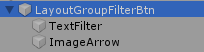

“LayoutGroupFilterBtn”上挂着“Horizontal Layout Group”，“TextFilter”上挂着“Content Size Filter”

**解决办法：**

<font color=blue>**1.首先解决居中显示：**</font><font color=red>**设置“Horizontal Layout Group”的“child alignment”为“Middle Center”**</font>

由于文字的高度height明显大于箭头图标height，并且箭头图标不适宜拉伸或放大。<font color=red>**在这种情况下，直接修改Layout下所有item的对齐方式即可让箭头图标也居中显示，而无需修改箭头的scale或size**</font>

2.当在“TextFilter”上添加“Content Size Filter”后，如果文字内容变化，TextFilter自身的size会自动适应为"preferredHeight/preferredWidth"。

**但是“LayoutGroup”重新绘制各个子item的坐标必须是以下情况：**

<font color=red>**该group下的item被直接的active/deactive，此时才会导致“LayoutGroup”强制刷新。**</font>

<font color=blue>**其他情况LayoutGroup并不会重新执行，比如item自身的size发生变化，此时该item的父类中挂载的“LayoutGroup”是不会再次自动执行的**</font>

**所以为了强制刷新LayoutGroup布局，可使用以下方法：**

```c#
LayoutRebuilder.ForceRebuildLayoutImmediate(rectTransform)
```

该方法专门对某个RectTransform下的子item重新刷新布局

**实际效果：**

当文字内容改变后(<font color=blue>**该文字Text对象上挂载了“Content Size Filter”自动修改RectTransform的size**</font>)，此时使用强制刷新布局的方法：<font color=red>**LayoutRebuilder.ForceRebuildLayoutImmediate(rectTransform)**</font>,  则该RectTransform会重新计算子item的Position, 如此高度和宽度都不一致的“箭头图标”以及“文字”就会马上重新刷新布局了。


## ScrollView:

### 需求1：

**在创建ScrollView后会发现ScrollView下的“Viewport”的RectTransform无法调整size**

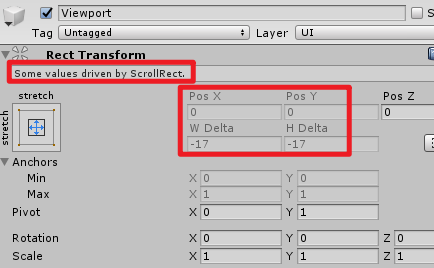    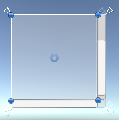

查看ScrollView中挂载的“ScrollRect”组件后：

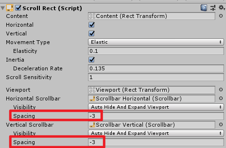

从以上设置可知：<font color=red>**Viewport边缘的“Delta”是为滑动条预留**</font>，因此可以在这里调整Delta数值

<font color=blue>**方式一：**</font>当设置Delta数值为“-20”时，则可以得到Viewport与父类ScrollView物体全贴合的效果：

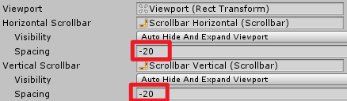   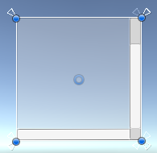

<font color=blue>**方式二：**</font><font color=red>**直接将边缘的滑动条删除，然后重新启用ScrollRect组件即可**</font>

<font color=blue>**注意：**</font>1.**仅仅删除滑动条会发现viewport依然无法自由设置size，此时需要重新启用ScrollRect组件**

​          2.重新启用ScrollRect组件指的是：<font color=blue>**将该组件先"enable = false"，然后设置"enable = true"**</font>


### 需求2：

**当text的宽或高没有超出scroll滑动区域时即使拖动该text也不会有滑动的效果，只有在Text的size超出scroll区域时才可以有实际的滑动效果**

**解析**：

**可以滑动Scroll内物体的条件：**

**<font color=blue>条件1：</font>**<font color=red>**理论上只要在物体A上挂载了“ScrollRect”组件，那么该物体的RectTransform区域内就已经具备了滑动的基础条件**</font>

**<font color=blue>条件2：</font>**<font color=red>**若需要拖动物体A区域内的其他物体，那么该物体一定需要开启可以监听射线的“Raycast Target”功能。**</font>

<font color=blue>**滑动的本质：**</font><font color=red>**当滑动列表时，其实滑动的是Scroll下的"ChildGameObject" —— “Content”，并不会单独滑动Content下某个特定的对象。**</font><font color=blue>**但由于这些对象全部放置在“Content”下，因此当“Content”位置发生改变时，其下的孩子物体也会相应的变化位置**</font>


基于以上原理：

<font color=blue>**效果一：**</font>如果在Scroll物体A上<font color=blue>**同时挂载“ScrollRect”组件和开启“Raycast Target”功能的其他组件**</font>，如"UIEmptyGraphic"。由于“UIEmptyGraphic”覆盖了Scroll的所有区域，因此在Scroll内任意位置都可以滑动Scroll下的

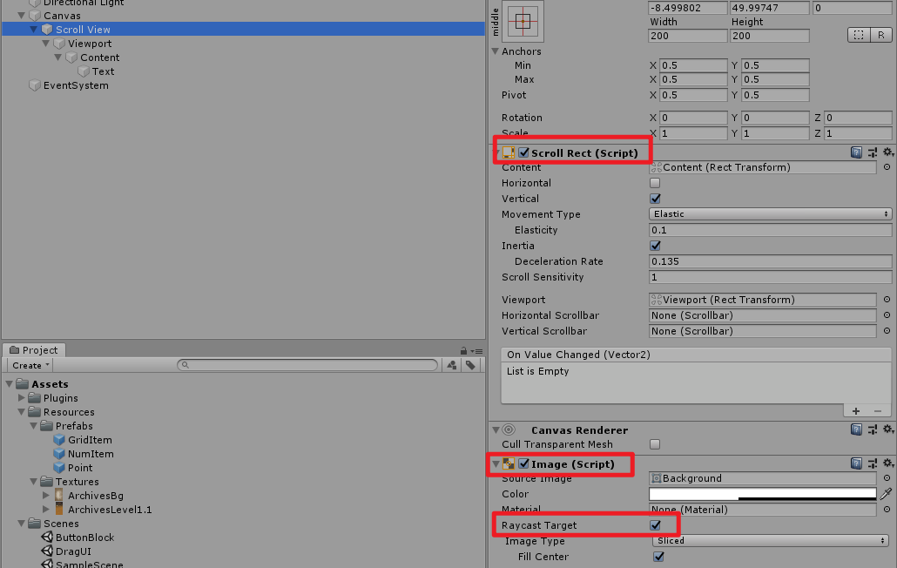


<font color=blue>**效果二：**</font><font color=red>**只有在点击到scroll下某些特定物体"DesignedGo"时才可以拖动整个content**</font>，则：

1. 关闭scroll自身挂载的“UIEmptyGraphic”组件中的“Raycast Target”
2. 同时在"DesignedGo"上添加开启“Raycast Target”功能的UI组件即可，如“Text”,"Image"等

<font color=blue>**效果三：**</font><font color=red>**当content没有超出Scroll显示区域时，无法滑动；当content超出显示区域时则可以滑动**</font>

1. 关闭scroll身上挂载的带有“Raycast Target”功能的组件
2. 在Content下添加带有“Raycast Target”功能的组件，如“UIEmptyGraphic”
3. 检测“Scroll”下的子物体“Content”的size(使用RectTransform.SetSizeWithAnchor或者借助content size fitter)，默认不开启“Raycast Target”；当超出scroll的显示区域时开启content物体的“Raycast Target”功能即可


## Content Size Fitter:

该组件的重要作用：
1.当该组件所挂载的GameObject没有子节点时，如Text或Image，此时则通常获取该Text或Image在“水平或垂直方向”的preferredWidth/preferredHeight，并设置自身RectTransform的width或height。
注意：==其对“Image组件”同样有效，其会获取该Image当前赋值的“Sprite”的“Native Width/Height”==来设置自身RectTrans的数值

2.当该组件所挂载的GameObject有子节点时，则通常配合HorizontalLayout或VerticalLayout一起使用。
注意：默认情况下，"xxLayout + ContentSizeFitter"组合会获取子节点的Width/height总和。但有些情况子节点中包含Text，且**Text组件的文本内容会实时变化**。若给子节点Text也添加“ContentSizeFitter组件”，则两者可能会冲突，在UI刷新上没有那么即时
**解决方法**：此时可打开==xxLayout的“Control Child Size”==即可。该==参数会实时获取子节点中Text或Image的preferredWidth/preferredHeight==，**并不需要给子节点单独添加“ContentSizeFitter组件”**


3.当用于”LayoutGroup“时，由于xxLayout的width/height被设定为preferred值，所以无论如何调整layoutGroup中的”**child alignment**“， ”**child force expand**“，其效果基本都是一样的。


### 实用场景1：content与scroll滑动区域设置调整

当“content”的height < scrollRect.height时，此时无论如何向上拖动content，由于content区域较小，因此都会自动回复到原始位置

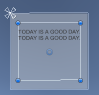

而当content.height > scrollRect.height时，在滑动content时如果下方空白区域太多，则容易出现如下情况：

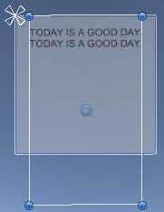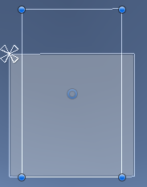

所以在该Text组件上添加“Content Size Fitter”自动更改Text的height区域，这样不论是向上或向下拖动都不会出现空白区域过多展示的情况


### 实用场景2：当在Text上添加“Content Size Fittler”后，获取Text的size时出错

解析：

**<font color=red>由于“Content Size Fitter”使用preferredSize设置RectTransform后并不会马上生效，必须要等一帧</font>**

因此这里可以使用**“LayoutRebuilder.ForceRebuildLayoutImmediate”在当前帧对该Text强制重绘制，这样可以获取到Text的正确size**

```c#
Text mText = GameObject.Find("Text").GetComponent<Text>();
Debug.LogFormat("@@@@@@@: size: {0}", mText.rectTransform.rect.size);
LayoutRebuilder.ForceRebuildLayoutImmediate(mText.rectTransform);
Debug.LogFormat("#######: size: {0}", mText.rectTransform.rect.size);
```

 运行效果如下：

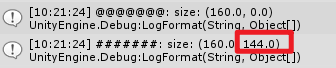

UI实际表现为：

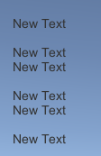

由此可见：“size.y == 144”才是该Text组件理想的高度height

#### PS:

另一种情况：https://blog.csdn.net/qql7267/article/details/104026135，后面遇到可以再研究下


