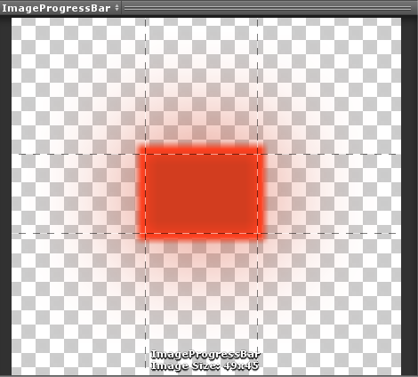
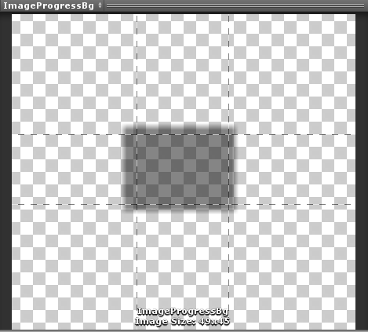
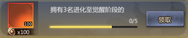
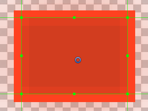
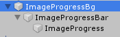
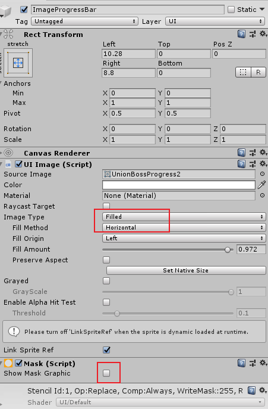
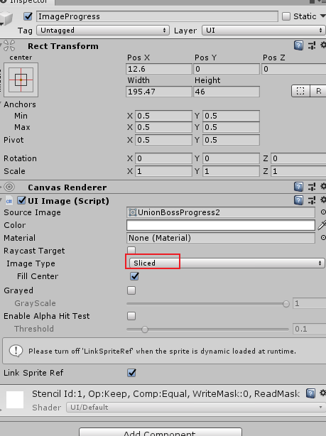
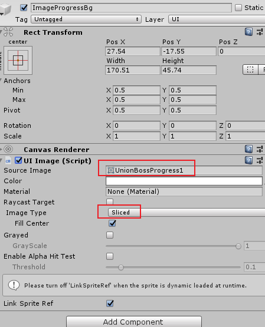

### 1.如何使用美术提供的非完整切割图片制作进度条？

在制作UI进度条时经常会遇到美术提供的进度条图片是：

由于图片边缘有很大的空余，因此如果直接在进度条Image中使用“simple”模式，则UI效果会有很大的偏差。

那么如何使用以上的图片来达到最适宜的进度条效果？

#### 解决方法：

思想：借助“sliced”，“Filled”以及“Mask”来组合得到目标效果

1.首先需要切割以上sprite的Border偏移，切割掉边缘多余的部分：

2.设置如下三层UI结构：

##### 原理：

**借助“Mask”的作用：当给某个UI对象挂载Mask组件后，超出Mask的区域会被过滤掉不予显示**

###### 1.创建mask父对象：ImageProgressBar

注意：**mask中“show mask graphic”不要勾选**，仅仅只是把该对象当作mask来使用

###### 2.在ImageProgressBar下创建子对象ImageProgress

注意：

1.以上两个image**使用完全一样的图片sprite，只是两者的imageType不同，前者为“Filled”当作遮罩使用，后者为“Sliced”。**

2.**两个image的size默认一致，但也可以根据实际效果微调，但总体思想不变。**

PS: 微调时需要根据理解mask的实际作用来做调整，以mask的作用为中心

通过**调整ImageProgressBar中的“FillAmount”**即可达到进度条的效果

###### 3.增加进度条背景板：

创建父类ImageProgressBg：

作为进度条的背景存在，即灰色背景条。

##### 4.将以上的“ImageProgressBar”放置在“ImageProgressBg”之下，作为ImageProgressBg的子对象存在，如此进度条UI即制作完成

