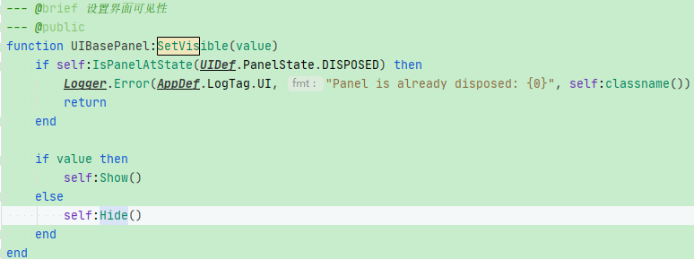
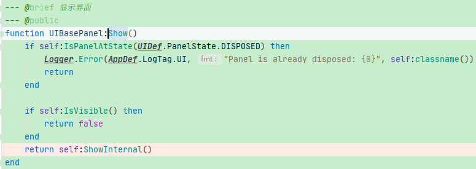
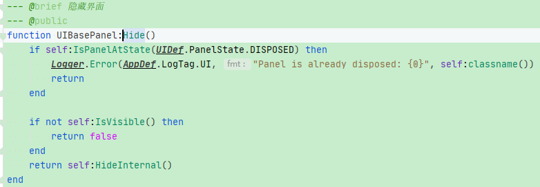

# 界面打开：


# 界面暂时隐藏：


# 界面关闭：


# 界面恢复：

### 实际案例：

1.部分情况下，从“PanelA”点击按钮后跳转到“PanelB”，当“PanelB”的操作执行完毕后关闭此页面，此时会重新显示“PanelA”。<font color=red>**此时如果“PanelA”在配置文件中通过“classname”和“SubPanell”的方式增加了“嵌套复用SubPanel”，那么根据现有机制会重新设置各个panel的显示状态，包括该panel中嵌套的“SubPanel”**</font>

```LUA
{
    path = "PanelBottom/PanelGift",
    type = UIDef.ControllerType.SubPanel,
    className = "EntryGoalsGiftTabSubPanel"
}
```

注意：在从“waitingPanel”中恢复某些Panel时，该Panel会根据之前记录的“PanelState”来设置当前的状态








在本例子中，<font  color=blue>**对于“PanelGift”如果在配置文件中没有填写该transform的初始状态，那么UI框架会默认记录该“classname”对应的“SubPanel”当前PanelState为“true”****</font>，<font color=red>**即使后面使用“SetActive”直接设置该SubPanel为false，如**</font>

```lua
self.panelGift.gameObject:SetActive(false)
```

<font color=red>**但在UI框架中记录的“PanelState”依旧为true**</font>

因此当从其他界面<font color=red>**重新恢复到本界面PanelA**</font>时，会<font color=red>**根据UI框架内部记录的“PanelState”来设置PanelA以及其所有嵌套SubPanel(配置文件中包含classname和SubPanel的对象)的状态**</font>

**由于“panelGift”记录的PanelState始终为true，因此此时会直接显示出“panelGift”来**

因此该问题解决办法：

```lua
function EntryGoalsPage:OnBottomTabSelectedChanged(index)
    index = index + 1
    self.panelTaskView.gameObject:SetActive(index == 1)

    -- ============== ************ 非常重要 *************** =============
    -- 对于配置了“className”和“SubPanel”的嵌套panel，其显示和隐藏不能直接使用“SetActive”,
    -- 必须使用通用的panel管理方法：SetVisible
    self.panelGift:SetVisible(index == 2)
    -- ============== ************ 非常重要 *************** =============

    if index == 2 then
        self.panelGift:SetData()
    end
end
```

**PS: 对于记录“PanelState”有两种方式**

**一种**是直接在该Panel的配置文件中设置初始状态"active = false"

```lua
{
    path = "PanelBottom/PanelGift",
    type = UIDef.ControllerType.SubPanel,
    className = "EntryGoalsGiftTabSubPanel",
    active = false
}
```

<font color=blue>**如果没写“active”参数，则默认该“SubPanel”的初始PanelState为true**</font>

**另一种**则是使用UI框架中“Panel”专属的“SetVisible”方法，该方法会在UI框架内部记录该Panel的当前“PanelState”


### 界面关闭回调：

形式一：打开页面时，通过在context中添加callback实现关闭界面或其他情况下的回调

```
sq.facade:GetUIManager():CreatePanel("BattleSoulCopyExploreTeamWindow",
            { missionId = self.missionId, callback = Slot() })
```

形式二：阻塞当前协程，当面板关闭后重新恢复该协程

这里使用"coroutine.running",  "coroutine.yield", "coroutine.resume"在协程间切换


### SubPanel的context参数传递：

在配置文件中当需要向某个SubPanel的“OnOpen”方法中传递参数时使用如下的方式：

```lua
{
    path = "SafeArea/ImageTitleBg/PanelResource/ResourceDiamond",
    type = UIDef.ControllerType.SubPanel,
    className = "ResourceAddSubPanel",
    params = { goodsId = AppDef.Token.Diamond }
}
```

上述的<font color=red>**“params”**</font>即是在配置文件中打开“subPanel”时会调用subPanel的“OnOpen”方法，如果没有“params”参数，那么在subPanel的OnOpen方法中则不能传递context参数

如果不需要向subPanel中传递参数，则无需使用context参数：

```lua
--- @brief 界面打开处理
--- @param context table
--- @protected
function EntryGoalsGiftTabSubPanel:OnOpen()
    self.currentGiftSelectedDay = 1
    self.allGiftDayItems = {}
end
```

虽然无法使用context参数，但可以在subPanel的OnOpen中创建自定义的参数

<font color=red>**如果需要传递参数则使用如上“params”的方式即可**</font>


