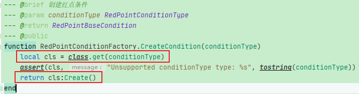
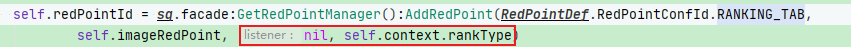
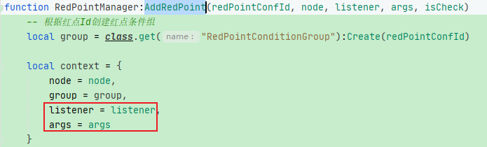

问题：现有的Lua框架内，当需要在代码中创建一个新的lua类型的对象时，直接使用：

即可达到效果：

`local cls = class.get(xxxx), cls:Create` 的具体逻辑是怎样的？

在lua整体逻辑中：将prefab与lua绑定，并执行相应的逻辑，这个要仔细看一下

如果在C#中，当创建GameObject后，由于其上挂载有MonoBehavior派生类，可以自由的调用“Start/Update”等逻辑，但如果是lua，则需要将prefab和lua绑定，然后在外部调用相应的逻辑方法

现有红点体系的唯一优点在于：

提供了一个红点最终显示或者隐藏的回调，比如红点的“Check”逻辑执行完得到结果后会执行该回调通知其他地方，并且支持传入回调中要用的参数(这个参数可以在“AddRedPoint”时就添加，但避免参数值固定，这里使用“self.rankType”的形式)：

在新的前缀树红点系统中可以加入此“回调”特性，因为有些功能可能需要监听红点的逻辑，比如当红点显示时，执行AAAAAA；当红点消失时，执行BBBBBB。

这里的回调建议使用“事件发送”的形式，只管发送事件，不管发送事件之后的影响 —— 这才是事件的正确用法，事件的使用也可以将多个模块解耦，独立的执行

现有红点体系存在最大的问题：各个红点之间完全是独立的，没有任何父子关系，即没有多叉树机制只依赖事件机制刷新。外层的红点要监听所有子红点的事件，但不受子红点的返回结果影响，完全独立执行。效率极为低下

同时若短时间内有多个红点事件则会多次刷新，效率低

在cfg配置文件中绑定红点：
1.创建红点GameObject：

UIBasePanel:Active: self:BindElements()

2.添加红点监听：

UIBasePanel:Open： self:BindRedPoints()

