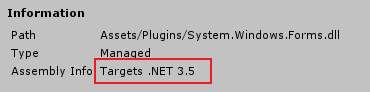

### 功能需求：

在非Editor模式下，打开windows资源管理器选择指定文件夹或多个文件，并通过MD5校验区分出内容不同的文件

1.导入Dll：

- **System.Windows.Forms**：必须使用Unity安装目录下的“system.windows.forms.dll”

  

  <font color=red>**其他路径下的“windows.forms.dll”都不行**</font>

- **Ookii.Dialogs**：原生的“windows.forms.dll”在显示资源窗口时UI风格较为原始，功能比较单一，这里使用升级版的“Ookii.Dialogs”(该插件依赖于windows.forms.dll，两者都需要导入)

  链接：https://www.ookii.org/software/dialogs/，(选择右侧的“download Ookii.Dialogs”，而不是下方的Github)

  

2.在Assets下新建“Plugins”文件夹，放入以上两个dll：


3.编写脚本：

选择文件夹：

```c#
string SelectFolderWindow() {
	var folderWindow = new VistaFolderBrowserDialog() {
		Description = "请选择目标文件夹",
		ShowNewFolderButton = false,
		RootFolder = Environment.SpecialFolder.MyComputer,
	};
	if (folderWindow.ShowDialog() == DialogResult.OK) {
		return folderWindow.SelectedPath;
	}

	return null;
}
```

选择文件：

```c#
string[] SelectFileWindow() {
	var fileWindow = new VistaOpenFileDialog() {
		InitialDirectory = "file://" + Application.dataPath,
		Filter = "文件|*.cs;*.txt",
		RestoreDirectory = true,
		FilterIndex = 1,
		Multiselect = true
	};
	if (fileWindow.ShowDialog() == DialogResult.OK) {
		return fileWindow.FileNames;
	}

	return null;
}
```

PS:

1.打开的窗口中只显示指定类型的文件

格式：标识文字|文件后缀，<font color=blue>**多个文件后缀间使用分号“;”连接**</font>，如：


如不需要筛选则使用：`Filter = "所有文件|*.*`

2.<font color=blue>**支持选择多个文件需要开启“Multiselect = true”**</font>，否则无法一次性选择多个文件

<font color=red>**3.在UnityEditor下打开资源管理窗口：EditorUtility.OpenFilePanel**</font>

4.使用`Directory.GetFiles`查找路径下指定类型文件：

```c#
string[] filePaths = Directory.GetFiles(dirPath, "*.txt");
```

<font color=red>**与“OpenFileDialog”的“Filter”不同吧，不需要前面的筛选“标识文字”**</font>


#### 获取文件md5码，用于检验：

```c#
string GetMD5HashOfFile(string filePath) {
	using (FileStream fs = new FileStream(filePath, FileMode.Open)) {
		MD5 md5 = new MD5CryptoServiceProvider();
		byte[] val = md5.ComputeHash(fs);

		StringBuilder sb = new StringBuilder();
		for (int i = 0; i < val.Length; ++i) {
			sb.Append(val[i].ToString("X"));
		}

		return sb.ToString();
	}
}
```

<font color=blue>**注意：如果两个文件文本内容相同，只是文件的名字不同，这两个文件的MD5是一样的**</font>


**运行效果：**


**PS：在Editor中运行时一切正常，但是打包时出现以下错误**


<font color=red>**解决办法：**</font>

1.确保使用的“windows.forms.dll”为该版本Unity安装目录“Editor/Data/Mono/lib/mono/2.0”下的

2.修改打包设定：获取以上“windows.form.dll”的“Assembly Info”



当为“.NET 3.5及以上”时，设置“Player Setting -> ......  ->API Compatibility Level”为“.NET 4.X”(并使用“Mono” Scripting Backend)


3.如果切换上述“API Compatiblility Level”后依然打包报错，可以尝试重启Unity(有些情况改变Compatibility Level后可能需要使用Unity重新打开该项目才会起效)


完整代码如下：

```c#
using System;
using System.Collections.Generic;
using System.IO;
using System.Security.Cryptography;
using System.Text;
using System.Windows.Forms;
using Ookii.Dialogs;
using UnityEngine;
using UnityEngine.UI;
using Application = UnityEngine.Application;
using Button = UnityEngine.UI.Button;

public class CompareFiles : MonoBehaviour
{
    private readonly string LastDirPathKey = "lastSelectDirForCompare";

    private string dirPath;
    private string[] filePaths;
    private InputField dirInputText;
    private Text fileTotalNumTxt, resultText, exceptionTxt;

    void Start() {
        InitUIBinding();
        UpdateView();
    }

    void InitUIBinding() {
        var dirPathInputConfig = "Canvas/PanelTop/InputField";
        var fileTotalNumConfig = "Canvas/PanelTop/FileTotalNumText";
        var resultConfig = "Canvas/PanelDetails/ResultText";
        var exceptionConfig = "Canvas/PanelDetails/ExceptionText";
        dirInputText = GameObject.Find(dirPathInputConfig).GetComponent<InputField>();
        fileTotalNumTxt = GameObject.Find(fileTotalNumConfig).GetComponent<Text>();
        resultText = GameObject.Find(resultConfig).GetComponent<Text>();
        exceptionTxt = GameObject.Find(exceptionConfig).GetComponent<Text>();

        var btnFolderConfig = "Canvas/PanelTop/BtnFolder";
        var btnCompare = "Canvas/PanelDetails/BtnCompare";
        GameObject.Find(btnFolderConfig).GetComponent<Button>().onClick.AddListener(SelectFolderWindow);
        GameObject.Find(btnCompare).GetComponent<Button>().onClick.AddListener(CompareFilesByMd5);
    }

    void UpdateView() {
        var lastDirValue = PlayerPrefs.GetString(LastDirPathKey);
        if (string.IsNullOrEmpty(lastDirValue)) {
            return;
        }

        dirInputText.text = lastDirValue;
        filePaths = Directory.GetFiles(lastDirValue, "*.txt");
        fileTotalNumTxt.text = filePaths.Length.ToString();
    }

    #region 工具方法
    void CompareFilesByMd5() {
        var dirPath = dirInputText.text;
        if (string.IsNullOrEmpty(dirPath)) {
            exceptionTxt.text = "路径为空，请先选择目标文件夹";
            resultText.text = "";
            return;
        }

        if (!Directory.Exists(dirPath)) {
            exceptionTxt.text = "该文件夹不存在，请重新选择";
            resultText.text = "";
            return;
        }

        filePaths = Directory.GetFiles(dirPath, "*.txt");
        if (filePaths.Length <= 0) {
            exceptionTxt.text = "该文件夹下没有可以比对的日志文件";
            resultText.text = "";
            return;
        }

        exceptionTxt.text = "";
        //统计文件md5
        Dictionary<string, List<string>> md5DicList = new Dictionary<string, List<string>>();
        for (int i = 0; i < filePaths.Length; ++i) {
            var fileMd5 = GetMD5HashOfFile(filePaths[i]);
            var fileName = Path.GetFileNameWithoutExtension(filePaths[i]);
            if (md5DicList.ContainsKey(fileMd5)) {
                md5DicList[fileMd5].Add(fileName);
            }
            else {
                var fileNameListByMd5 = new List<string> {fileName};
                md5DicList.Add(fileMd5, fileNameListByMd5);
            }
        }

        //UI刷新
        StringBuilder finalLabel = new StringBuilder();
        foreach (var temp in md5DicList) {
            StringBuilder sb = new StringBuilder();
            sb.Append("MD5: ");
            sb.Append(temp.Key);
            sb.Append("  count: ");
            sb.Append(temp.Value.Count);
            sb.Append("\n代表文件name: ");
            sb.Append(temp.Value[temp.Value.Count - 1]);

            finalLabel.Append(sb);
            finalLabel.Append("\n");
        }
        resultText.text = finalLabel.ToString();
    }

    string GetMD5HashOfFile(string filePath) {
        using (FileStream fs = new FileStream(filePath, FileMode.Open)) {
            MD5 md5 = new MD5CryptoServiceProvider();
            byte[] val = md5.ComputeHash(fs);

            StringBuilder sb = new StringBuilder();
            for (int i = 0; i < val.Length; ++i) {
                sb.Append(val[i].ToString("X"));
            }

            return sb.ToString();
        }
    }

    void SelectFolderWindow() {
        var folderWindow = new VistaFolderBrowserDialog() {
            Description = "请选择目标文件夹",
            ShowNewFolderButton = false,
            RootFolder = Environment.SpecialFolder.MyComputer,
        };
        if (folderWindow.ShowDialog() == DialogResult.OK) {
            dirPath = folderWindow.SelectedPath;
            dirInputText.text = dirPath;
            filePaths = Directory.GetFiles(dirPath, "*.txt");
            fileTotalNumTxt.text = filePaths.Length.ToString();
            exceptionTxt.text = "";
            //记录下最近选择的目录，下次打开默认选择上一次的目录
            PlayerPrefs.SetString(LastDirPathKey, dirPath);
        }
    }

    void SelectFilesWindow() {
        var fileWindow = new VistaOpenFileDialog() {
            InitialDirectory = "file://" + Application.dataPath,
            Filter = "日志文件|*.txt",
            RestoreDirectory = true,
            FilterIndex = 1,
            Multiselect = true
        };
        if (fileWindow.ShowDialog() == DialogResult.OK) {
            //显示文件目录
            dirPath = Path.GetDirectoryName(fileWindow.FileNames[0]);
            dirInputText.text = dirPath;

            //该目录下所有文件
            filePaths = fileWindow.FileNames;
            fileTotalNumTxt.text = filePaths.Length.ToString();
            exceptionTxt.text = "";
        }
    }
    #endregion
}
```

