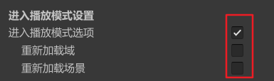
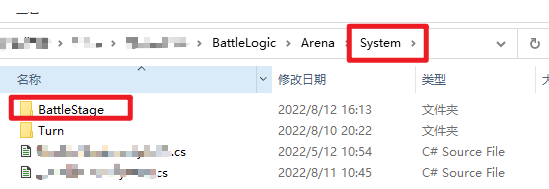
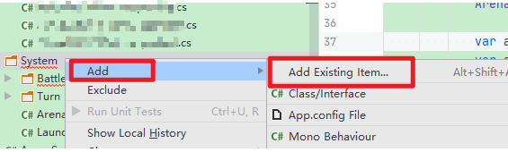

[TOC]

#### Unity:

##### 在UnityHub中获取license时一直处于等待中

**解决方法**：删除原有的license文件，路径“C:ProgramData/Unity/Unity_lic.ulf” (“ProgramData”为隐藏文件夹，需手动打开)，之后重启UnityHub

##### 使用PackageManager安装账号中已购买的插件时，显示“UnityID”验证失败

**解决办法：**该问题与网络代理有关。故关闭网络代理后，重启UnityHub，重启Unity

##### 关闭Unity的自动刷新

针对Unity2021及以上版本，关闭“自动刷新”按钮在此界面：

**3.经常遇到不同的项目使用各个版本的Unity Version,可以都通过Unity Hub来下载**，**不需要单独去Unity官网下载**：

点击上图中的“下载存档”即可跳转到浏览器中Unity各个“历史版本”列表界面。

注意：**直接在浏览器Unity“历史版本”界面选择“目标版本”**的**“在Unity Hub中下载”**，这样会直接跳转到UnityHub下载该版本，并且UnityHub还会弹出各个Platform的module以供选择，非常方便。

**4.在向Git或SVN上提交文件时**，其实**只需要上传“Assets”、“ProjectSettings”、“Packages”三个文件夹**，其他的内容除非特殊情况需要，一般都不用上传

**5.Unity中的PackageManager下载的包地址**："c:\Users\xxx\AppData\Roaming\Unity\AssetStore"

**Unity中默认的C#脚本模板地址**：#安装目录#/Editor/Data/Resources/ScriptTemplates

**6.设置UnityEditor为中文：**

使用UnityHub为对应的Editor安装模块中选择“语言-》中文简体”，安装完成后需要重启UnityEditor(无需重启UnityHub)。重启之后在“Preferences”左侧菜单中可以看到“Languages”选项，调整为“中文”即可

**7.每次点击“Play”按钮时都会重新“Reload Scripts Assemblies”，极不方便**

**解决办法**：Edit -> Project Setting ->Editor(编辑器)，打开“Enter Playmode Options”，不要勾选“reload scene”及“reload script assemblies”选项

默认情况当没有勾选“enter playmode options”时会自动加载“域和场景”

#### Rider:

##### 在使用Rider时遇到右上角没有“Attach to Unity Editor”选项，无法调试断点

**解决办法**：在“File->Setting->Plugins”中重新安装或启用"Unity Support"，并保存重启Rider即可

PS:如果Rider中已安装"Unity Support"插件，那么此时在“Marketplace”中是查找不到的，直接在“Installed”中查找即可

**扩展**：部分情况下虽然有“Attach to Unity Editor”，也能够正常连接Unity调试，但是程序运行时在代码的断点处却无法“定住”，此时可以尝试在选择调试方式时先改为“Attach to Unity Editor & Play”，如果该模式下Unity可以正常在代码处断点，则后续切换为“Attach to Unity Editor”即可

##### 设置Rider中右侧当前选中的文件Tab颜色：

Setting -> Editor -> Color Scheme -> General ->... -> Editor -> Tabs -> Selected Tab

同时**还需要设置标签底部的“Underline”和“Underline inactive”，两者都设置红色即可**，效果：

##### 设置Tab的关闭按钮显示在EditorTab的左侧，以方便关闭：

Setting -> Editor -> General ->Editor Tabs：

##### 同时展示两个代码编辑窗口

点击某个已打开脚本的“Editor Tab”，鼠标右键选择“Split Vertically”，即可同时打开两个编辑窗口。

为了方便展示，此时会设置“Editor Tab”展示在“Top”，同时将左侧的“Project View”窗口设置为“Dock unpinned”。如此展示效果比较美观：

##### 顶部横栏菜单中不展示“Debug -》 Attach to Unity Editor”的快捷菜单按钮：

点击菜单栏“View -> Appearance -> Toolbar”即可

##### 本地有某个文件，但在Rider中却无法识别到该文件

**描述**：每个项目中的“xxx.csproj”在Rider中创建文件时会自动在“xxx.csproj”中添加该文件配置，平常并不需要注意这个文件。但当多人开发时，从远程仓库拉取该文件时经常会遇到冲突的情况。如果一不小心将该“xxx.csproj”还原了，那么项目中新添加的文件也会被排除在项目外 —— 这种情况下在Rider中是识别不到这个文件的。

那么当本地有某个文件，但在Rider中却无法识别到该文件时：

如上，本地在“Arena”文件夹下有“BattleStage”，但在Rider中却无法识别出来 —— 这就是刚才把“xxx.csproj”还原导致的结果，通常在git合并分支时处理冲突导致

**解决办法：只需要将该文件或文件夹重新添加到Rider的项目中即可**

添加完之后Rider会自动在“xxx.csproj”中添加该文件的配置

##### 使用Rider创建Dll库项目

当使用Rider创建Dll库项目时，==默认选择“.NET Class Library”，而不要选择“.NET Core Class Library”==。前者使用**传统C#项目工具套件开发，编译得到的dll可以在Unity项目中使用**；后者则是另一套开发工具套件，并且与普通的C#项目无法兼容

##### 修改脚本编辑窗口中代码的字体大小

菜单栏“Setting -> Editor -> Color Scheme -> Color Scheme Font”，调整Size即可

#### Typora：

##### 开启文本“高亮”并设置其颜色

在“偏好设置 -》Markdown”中勾选“高亮”

在“偏好设置 -》外观”中打开“主题文件夹”，如“softgreen.css”，搜索“mark” —代表“高亮”相关配置，改成如下形式：

其中“background-color”代表“高亮文本”的==背景色==，“color”代表文字的颜色

##### 设置“高亮”快捷键

在“偏好设置 -》通用”中点击“打开高级设置”，选择“conf.user.json”文件，在“keyBinding”中添加“Highlight”即可：

#### SVN：

##### 查看下载到本地的SVN项目当前的版本号

**详细说明**：该需求主要针对部分情况，需要下载SVN指定版本号的内容到本地用于校验或参考，因此需要设定“Revision”。而不需要该项目在SVN上的最新版本

**步骤**：

1).由于后续操作需要用到SVN命令行，因此在安装SVN时需要勾选以下选项：

**PS**：若SVN已安装，则重新点击该exe文件并选择“Modify”安装该工具即可

**检测SVN命令工具是否安装成功**：Win + R 打开cmd窗口，并输入“svn --version”，若显示如下则代表安装成功：

**2)**.打开SVN项目的本地目录，按住Shift键 + 鼠标右键 打开Powershell窗口，并输入指定“svn info”

其中“Revision”即代表该项目在本地的当前版本

#### Rider常用插件：

EmmyLua：调试lua代码必备，Rider安装时自带

RainbowBrackets：用不同颜色区分代码中所有的括号区域

GitToolBox：直接在编辑器中显示每行代码的“Blame”提交记录

Extra Icons：为文件添加自定义的图标，文件容易区分(需付费0.5美元)

Chinese Simplified：中文语言包

Smart Input：自动切换中英文，注释行自动切换为中文，代码行自动切换为英文

