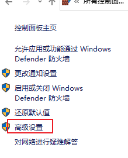

[TOC]


### 1 Win10中添加病毒排除项：

点击桌面右下角“所有设置”，打开“设置”界面 -> “更新和安全”，


“Windows 安全中心” ——》“病毒和威胁防护设置” ——》“排除项”


点击“+”添加需要排除的文件或文件夹即可。这样Win10在扫描的时候则会排除该选项，不会把疑似病毒文件删除掉

### Windows及Office激活软件无法打开：

如上同样打开“Windows安全中心 -》病毒和威胁防护”，在点击“HEU_KMS_Activator.exe”后，这里会显示“病毒拦截记录”，此时设置其允许即可


### 2.Win10禁止某个应用联网：

控制面板-》Windows Defender 防火墙：


高级设置：



“出站规则”-》“新建规则”：


规则类型：程序


设置“程序路径”：


选择“阻止连接”：


选择目标网络类型(默认全选即可)：


自定义名称即可：


点击“确定”即可在主界面“出站规则”列表中看到：


### 3.关闭Windows资源管理器中的“文件复选框”：


方法：菜单栏“查看”，取消“项目复选框”即可：


### 4.Win10禁止更新：

打开“任务管理器”：菜单栏“服务”，点击下方的“打开服务”按钮


选中“Windows Update”后，鼠标右键点击“属性”：


将“启动类型”设置为“禁用”：


在“恢复”菜单下，设置“第一、二、三”次失败后都不执行任何操作，并设置“重置失败计数”的时间在最大值“1000”天后(无限期延后更新计数)


#### 补充方式一：

基于Win10中禁止应用联网的功能，这里计划将执行“Win10更新”的程序加入“出站规则”：

获取“Win10更新”应用程序：


将如上路径加入Windows防火墙网络“出站规则”


#### 补充方式二：

如果当前电脑的网络为“按流量计费”的网络，则Win10会禁用“自动更新”功能：

点击右下角网络图标：


选中并点击当前电脑已连接的网络：


点击该网络：


打开“按流量计费的连接”按钮即可：


### 5.Win10重启“Explorer.exe”：

#### 首先关闭“Explorer.exe”：

部分设置修改后需要重启Windows资源管理器后才能生效，如修改某个注册表配置后：

打开“任务管理器”，找到“explorer.exe”，点击“结束任务”(部分情况会直接显示“重启进程”，此时可以自动重启，无需后续操作即可)


#### 重启“Explorer.exe”：

有些情况在关闭“explorer.exe”后无法自动重启“explorer.exe”，需要手动启动：

点击“**<font color=red>Ctrl + Alt + Delete</font>**”选择“任务管理器”，点击菜单栏“文件 -》 运行新任务”：


输入“explorer”，**<font color=red>勾选“以系统管理权限创建此任务”</font>**，然后点击“确定”即可重启“explorer.exe”


### 6.Win10找不到“gpedit.msc”文件，无法开启“组策略”

Win10不同版本开放的系统功能不同，如**<font color=blue>Win10家庭版中并没有“本地组策略”</font>**，即“gpedit.msc”。该功能**<font color=red>只有在“Win10企业版或旗舰版”中才有</font>**。

因此这里使用其他方式在“**Win10家庭版**”中开启“本地组策略”：

1).新建txt文件，并将**<font color=blue>以下内容拷贝到文件中并保存</font>**：

```
@echo off

pushd "%~dp0"

dir /b C:\Windows\servicing\Packages\Microsoft-Windows-GroupPolicy-ClientExtensions-Package~3*.mum >List.txt

dir /b C:\Windows\servicing\Packages\Microsoft-Windows-GroupPolicy-ClientTools-Package~3*.mum >>List.txt

for /f %%i in ('findstr /i . List.txt 2^>nul') do dism /online /norestart /add-package:"C:\Windows\servicing\Packages\%%i"

pause‍
```

2).将该文件重命名为“组策略**<font color=red>.cmd</font>**”后，鼠标右键选择“**<font color=red>以管理员身份运行</font>**”。待运行完成后，则可以在“Win10家庭版”中开启“本地组策略”功能


3).之后在运行窗口(Win + R)中输入“gpedit.msc”即可打开“本地组策略编辑器”：


### 7.Win10更新重启后“任务栏一直卡顿，加载极慢”

Win10部分更新安装后重启后耗时极长，并且进入Windows桌面后，鼠标如果移动到任务栏处则一直显示“加载中的圆圈”，并且键盘上点击“Win图标”按键后也无法正常响应

出现该问题的原因是：Win10更新安装后会自动开启任务栏中的“资讯和兴趣”组件，而该组件的功能需要联网微软服务器，但该服务器在国外，从而导致速度极慢


**解决办法**：

步骤1：在重启电脑时断网，如拔掉网线或断掉wifi。按“ctrl + alt + delete”可以呼出系统菜单，右下角可以选择断开Wifi连接。当网络断掉后可以较快恢复正常

步骤2：关闭“资讯和兴趣”组件。如上图，在任务栏中鼠标右键选择“资讯和兴趣 -> 关闭”即可

步骤3：部分情况下关闭“资讯和兴趣”组件功能依然无法避免以上问题。因此下述增加“**<font color=red>本地组策略</font>**”的方式将其永久关闭

1).“Win + R”打开“运行”窗口，输入“gpedit.msc”打开“本地组策略”菜单，找到路径：“计算机配置-管理模板-Windows组件-资讯和兴趣”


2).点击“编辑策略设置”，将其禁用即可：


如此即可将“资讯和性趣”彻底关闭，重启后不会在“任务栏”卡顿了


### 8.Win10屏幕在一段时间没操作后自动闪一下然后恢复原样

有时候win10笔记本屏幕在**短时间内没操作后(如5分钟)会突然闪一下**，关键是**<font color=red>没有做任何操作屏幕突然又恢复正常</font>**

**排查过程**：

1.在检查电脑本身的“电池模式”，如“平衡模式”、“节能模式”，确保不是因为此原因导致屏幕在没有操作一段时间后闪烁

2.检查电脑所有的驱动程序，确保驱动是正常的(可以使用360驱动大师，甚至可以使用360安全卫士杀毒都检查一下)

3.基于以上步骤都试过，依然没有解决问题。最后通过“ChatGPT for google”仔细描述问题后，AI给出可能的原因：**<font color=red>屏幕保护程序</font>**

Win10自带“屏幕保护程序”，**<font color=blue>在“一段时间(可以自由设置)”没有操作后会自动启动“屏幕保护程序”，避免程序长时间显示一样的图像导致烧屏情况</font>**。"屏幕保护程序"的命名也由此而来

**调整“屏幕保护程序”**：

Win10桌面鼠标右键选择“个性化” ——》锁屏界面 ——》屏幕保护程序设置：


在该页面设置“屏幕保护程序”的触发时间和效果，也可选择关闭该“屏幕保护程序”


### 9.JetBrains的“ETW Host Service Updater”和“触摸板Elan Service”总是自动启动，如何禁止：

**针对“ETW Host Service Updater”**：

在多种方式尝试之后，只有“完全卸载”才可以禁止其启动。因此直接在“控制面板”中卸载该应用即可

**注意**：这里仅仅只是卸载Etw Host Service Updater，不是卸载“JetBrains Rider”。并且经过测试，卸载“Etw Host Service Updater”不会对“Rider的使用”有任何影响


**针对“触摸板Elan Service”**：

在“Win + R”中输入“**<font color=red>services.msc</font>**”打开服务窗口，查找“Elan Service”服务，鼠标右键打开“属性”窗口，**将其“启动类型”设置为“禁用”**即可


### 10.Win10显示“休眠”按钮

“控制面板 -> 电源选项 -> 选择电源按钮的功能”：


先点击上方的“更改当前不可用的设置”，之后勾选下方“休眠”选项即可


### 11.Win10右下角只显示时间，不显示日期

**解决方法**：在“任务栏”中鼠标右键选择“任务栏设置”


关闭“小任务栏”按钮即可：

 


