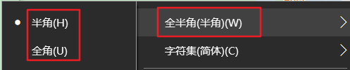
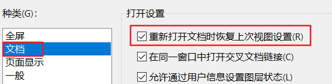
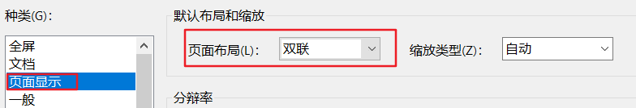

[TOC]


### CODING专区：

#### 1.编辑相关

1).左缩进：shift + tab，右缩进：tab

cmd窗口快速跳转到指定文件夹：**<font color=red>cd /d d:/test</font>**

护眼色：C7EDCC，"RGB值"分别为“195，237，204”

Excel中换行：Alt + Enter

2).英文字符之间间隔突然变大： shift+空格键。有的时候这种方式也不管用。

故必然管用的方式：点击右下角输入法图标，找到“全角/半角”的按键，切换下就好了




3).所有十进制编码所代表的字符意义：https://habaijian.com/

4).Excel中换行：Alt + Enter     切换光标：Ctrl + 功能按键

5).Win10在“目标文件夹中打开cmd窗口”：在Windows资源管理器中进入到目标文件夹，然后按住“**<font color=blue>shift</font>**”同时**<font color=blue>鼠标右键</font>**即可出现“在此处打开cmd窗口”的选项：


6).当需要为某个文件或文件夹命名为空时：Ctrl + delete(单独按delete是无法直接将文件命名为空的)

##### 相对路径：

当需要查找当前文件的上一层目录时，可以使用“..\”来获取，例如要获取当前文件上一层目录下的“功能需求”文件夹下的“动画播放”等其他文件时，则可以使用路径：`..\功能需求\动画播放.md`

其中“..\”可以获取到当前文件的上一层目录，即“工具”文件夹下

**案例1**：“Application.dataPath”路径为“xxx/Assets”，因此需要先添加“/”后再使用“../”或“..\”来切换到“父级目录”。并且在“Assets文件夹”路径后添加“/”，即代表“进入到Assets文件夹的子目录下”

```c#
Application.dataPath + "/../../GenerateDatas/json/" + file + ".json"
```


#### 2.Rider

批量注释或取消的快捷键：Ctrl + Shift + /

折叠所有代码：ctrl + m + a

格式化代码：ctrl + alt + enter

**PS**：菜单栏File -> Setting -> Keymap，直接搜索目标功能即可，如格式化“format”


##### 修改背景色步骤：

1.“Appearance & Behavior” -> "File Colors"增加“豆沙绿”颜色：


2."Editor" ->"Color Scheme" -> "General"修改文本颜色：


#### 3.Typora

整体放大或缩小：ctrl + shift + -/= （菜单栏“View”放大/缩小）

取消所加的富文本标记如color、加粗等：ctrl +\  

设置目标内容为“代码”：ctrl +shift + ~

添加代码块：ctrl + shift + k

AutoHotKey软件下载地址：https://www.autohotkey.com/

**Win11按下快捷键后导致无法应用无法再打开，并且无法输入**

重现过程：先按下“Ctrl + B”加黑“目标文本”，之后按下“Alt + 1”加红“目标文本”，之后则发现输入完全失效，并且之后无法再打开Win11的任何应用

解决方案：按下“Alt + Num Lock”，之后再开启即可

#### 4.ILSpy

C#编写的dll反编译工具，开源工程地址：https://github.com/icsharpcode/ILSpy

作用：可以将任何C#编写的dll反编译，并且保存为完整的“xxx.csproj”工程。可以自由查看该dll中的所有代码，并根据需求添加部分代码，然后重新打dll给其他项目使用。

参考链接：https://cloud.tencent.com/developer/article/1895653

#### 5.draw.io

**<font color=blue>非常棒</font>**的画流程图工具，工程地址：https://github.com/jgraph/drawio-desktop

#### 6.Notepad++

**功能1：开启页签多行显示**


效果如下：


**功能2：在左侧展示“文件列表面板”同时关闭“顶部页签”**

勾选上图中的“文件列表面板->显示”，同时勾选右侧“标签栏 -> 隐藏标签栏”

**功能3：设置“Notepad++”的“文本内容”背景为“护眼色”**

菜单栏“设置 - 语言格式设置”打开如下界面：


设置“全局背景色”为“护眼色”，同时设置“字体”和“字体大小”，之后勾选“使用全局背景色”、“使用全局字体”和“使用全局字体大小”选项并保存即可

**PS**：若需要使用黑色背景，则可以选择==主题“Obsidian”==

**功能4：设置“Notepad++”左侧的“文件列表面板”背景为“护眼色”**


选择“Default Style”，并设置“背景色”即可

**功能5：生成MD5**

点击菜单栏“工具 -> MD5”，即可为指定字符串或文件生成MD5


**功能6：打开当前文件所属的工作区**

当需要打开当前文件所属的文件夹或者查看与该文件同一层级目录的其他文件时，可以点击菜单栏“视图 -> 文件夹工作区”

**功能7：开启“自动换行”**

文本内容随着窗口的宽度自动换行显示


#### 7.ChatGPT

访问OpenAI的API文档需要是“全局的美国代理”，其他地区的代理无法访问

#### 8.Snipaste

非常好的截图软件，支持从Microsoft Store下载并**<font color=blue>免费使用</font>**，也可以从其官网下载直接下载

**PS**：部分情况下，按下F1无法截图，此时是由于“Windows应用权限”导致的(可查看“帮助”文档)。将该软件以“**<font color=red>管理员身份运行</font>**”，或者在“右下角选中任务图标”后鼠标右键选择“**首选项**”菜单中勾选“以管理员身份运行”即可：


#### 9.Spicetify

专用于调整Spotify界面UI或主题的软件：https://spicetify.app/docs/getting-started

对于Spotify不用从“Microsoft Store”下载，直接下载官方安装插件即可

#### 10.百度网盘：

唯一提高下载速度，且正版**<font color=red>免费</font>**并**<font color=red>长期有效</font>**的方法：

菜单栏“设置”中，打开“利用闲置带宽优化下载速率”的选项ji'ke


#### 11.Clash For Windows：

**要点1：完全卸载ClashForWindows**

该软件包含“安装版exe”和“免安装版压缩包”(为方便后续升级版本，**<font color=red>建议使用“安装版exe”</font>**)，两种方式在卸载之后均有残留文件。**<font color=blue>为将其彻底卸载，还需要将以下文件删除</font>**：

1.升级的安装包文件：`C:\Users\用户名\AppData\Local\clash_win_updater`

2.软件的配置文件：`C:\Users\用户名\.config\clash`，`C:\Users\用户名\AppData\Roaming\clash_win`


**要点2：更新“xx.yml”后，“Proxies”页签下各个节点没有任何变化，或者不显示任何节点信息**

**原因**：

1.只有在“Profiles”页签下选中目标“xx.yml”文件后，“Proxies”页签才会显示该“xx.yml”下所有节点信息。如下图所示：


**<font color=red>只有在该“xx.yml”左边出现“绿色竖条”时，才代表该“xx.yml”当前被选中，并应用成功</font>**。**<font color=blue>此时才会在“Proxies”页签下显示该"xx.yml"中包含的所有节点信息</font>**。

右边的“转圈箭头”代表更新该“xx.yml”文件。如果只是点击该图标，虽然可以成功更新“xx.yml”，但并没有选中该“xx.yml”，因此“Proxies”页签下所有节点都不会更新。

2.当选中某个“xx.yml”文件，会自动对该文件中记录的所有节点信息、rule-providers等进行验证。部分情况下由于网络封禁，导致验证该文件内部信息失败，如因“rule-providers”中包含“jsdelivr.net”等信息，而该网站被封禁，因此出现“initialize rule provider xxxx....... deadline exceeded”报错。

由于是在第一次下载指定Url的“xx.yml”时，如果该“xx.yml”中包含被封禁的“rule-providers”网址，导致始终无法应用该“xx.yml”，因此出现“Proxies”页签下没有任何节点信息

**解决办法**：

以下提供两种解决办法。经过测试后，两种办法各有优劣，可视具体情况选择使用

**方法1**：经过实际测试，相同的“xx.yml”文件(包含被封禁的网址)，在“安卓端Clash”可以正常访问并应该该“xx.yml”文件。而在“PC端Clash”无法应用该文件，出现“initialize rule provider xxxxx ”报错。

因此**<font color=red>将手机开热点，直接使用手机的“数据流量”共享给PC</font>**。

经过实际测试，在PC连接手机的共享热点后，可以正常应该该“xx.yml”文件

**方法2**：由于仅仅只有“PC端Clash”中的“xx.yml”无法应用，因此删除该文件中包含被封禁的“rule-providers”设置以及所有相关信息。经过测试后，发现可以正常应用该“xx.yml”文件，“Proxies”页签下显示出该文件下所有节点信息。

但在点击右侧“转圈箭头”图标更新该“xx.yml”文件后，该文件又被还原，此时依然会报错。

因此**<font color=blue>此时依然需要使用方法1更新并应用该“xx.yml”文件</font>**


**要点3：部分情况下开启Clash代理后使用Chrome访问谷歌时，依然无法FQ**

**解决方法**：有可能是因为Win10网络代理的问题。

Clash在运行时会**<font color=red>自动开启</font>**Win10的网络代理，并且设置代理服务器地址为“127.0.0.1”，端口号“7890”：


注意：这里是“Clash软件自动开启的代理”，并不是人为手动开启的。因此**<font color=red>不能关闭该代理服务器，否则会导致无法FQ</font>**


**要点4：Clash中其他设定**


1.“**<font color=red>Port</font>**”右侧的“转换图标”默认是不开启的，保持如上“灰色”状态。如果需要将“本软件代理过的网络共享给局域网内的所有设备”，则会用到本端口。代表本Clash应用在Windows系统中占用的端口号。如果开启，则每次启动Clash后都会随机分配端口号，不利于局域网共享代理。

2.“**<font color=red>Allow LAN</font>**”用于将本软件已经代理成功的网络共享给局域网内所有设备。默认为关闭，当需要共享网络时，开启即可。

点击“三角图标”，即可展示**<font color=red>该PC的“局域网IP”</font>**，用于设置其他设备的代理地址：


3.“**<font color=red>Clash Core</font>**”右侧的“52947”编号代表“Clash核心”在Windows中运行时占用的系统端口号，默认是Win10直接分配的，不需要任何设置，保持默认即可

4.“**<font color=red>Home Directory</font>**”中包含各个"*.yml"文件，以及使用到“rule-providers”信息。当删除该Clash软件时，需要将这里的文件全部删除：


#### 12.Netflix

查看Netflix视频当前的分辨率：ctrl + shift + alt + D （快捷键在全屏状态偶尔会失效，切换成窗口状态即可）

#### 13.Unity

1.UniHacker破解工具：https://github.com/tylearymf/UniHacker，从该网站上下载对应的Unity.exe和UnityHub.exe版本(**<font color=red>必须是国际版本才支持破解</font>**)，并使用UniHacker软件破解即可

2.Unity的PackageManager中下载的各个插件存储位置：`C:\Users\用户名\AppData\Roaming\Unity\Asset Store-5.x`

#### 14.Switch

**Switch游戏下载时龟速**：

- 修改DNS：首选DNS—168.95.192.1，备用DNS—168.95.1.1

**Switch搜索不到手机热点**：

- **<font color=red>Switch支持“全部信道的2.4GHz”以及“36-64信道的5GHz”的WiFi</font>**，如果5G wifi的信道不在“36-64”之间，则Switch是无法搜索到的。其中“36-48”信道的“5G wifi”效果比较好

  

  **PS**：“2.4GHz”的Wifi信道一共有“1-14”共14个信道，其中“1-13”信道大多数设备都是支持的，信道“14”则尚未开放，大多设备都不支持

#### 15.科学上网

路由器插件下载(1.需要以“梅林路由固件”为基础  2.**<font color=red>支持Trojan节点</font>**)：https://github.com/hq450/fancyss

#### 16.路由器后台登录

通常情况下在浏览器中输入“192.168.1.1”可以直接登录“当前连接的Wifi的路由器后台”，但部分情况下，如“光猫本身有wifi功能，因此路由器连接在光猫后不需要再拨号，直接发射wifi即可”，这种情况下，该wifi的后台地址已经改变，不再是“192.168.1.1”

**<font color=blue>查找当前连接的Wifi的“路由器后台地址”</font>**：

- 手机连接wifi后进入“详情页面”，在下方的“路由器地址”标签即显示“当前的路由器后台地址”：**<font color=red>192.168.0.1</font>**，而非默认的“192.168.1”

  

#### 17.查询本机的局域网ip和外网ip，以及某个“www网址”的ip

**局域网ip**：“cmd”打开命令行窗口，输入“ipconfig”


**外网ip**：“cmd”打开命令行窗口，输入“curl ipinfo.io”


**某个“www网址”的ip**：“cmd”打开命令行窗口，使用“ping www.xxx”即可获取到该网址的ip


### 薅羊毛专区：

#### 1.Kindle美区

在Android手机登录Kindle美区账号时需要将手机的系统语言设置成“English”，然后重启再打开Kindle应用登录美区账号才有效(**<font color=red>如果系统语言是中文Kindle服务器会默认为国区登录</font>**)。**<font color=blue>登录完成后可以将系统语言切换回中文</font>**(此时对于登录美区账号的kindle已经没有影响了)

#### 2.Google印度

该地区的YoutubePremium和Google Play Pass都是最便宜的，但开通时需要**<font color=red>保证代理节点为“印度区”，并且GooglePay中的付款资料没有异常</font>**(可通过Google账号设置中查看GooglePay设置，如果右上方有“!”黄色提示则必须先解决)。

**PS**：如果GooglePay付款资料有异常，在点击解决后**<font color=blue>需要等待一周左右</font>**时间**<font color=red>确认解决结果“成功”</font>**后才可正常使用Google账号付款


### 精品应用：

#### 1.Lively Wallpaper

GitHub开源工程，**<font color=red>非常的好用，显示效果惊艳</font>**，但占用GPU资源。官网地址：https://www.rocksdanister.com/lively/

#### 2.KoodoReader

在Windows上看电子书的软件，效果非常好，支持中英文等多种语言。GitHub开源工程

#### 3.MacType

GitHub地址：https://github.com/snowie2000/mactype，优化Windows上的字体显示效果，支持多种类型切换

#### 4.Library Genesis

下载英文小说的Web网站，种类齐全，地址：http://libgen.rs/

#### 5.ContextMenuManager

修改Win10系统鼠标右键“展示菜单”的软件，可以自由调节鼠标右键后展示的任意菜单，屏蔽“迅雷、百度网盘”等流氓软件，地址：https://github.com/BluePointLilac/ContextMenuManager


### 其他内容：

1.佛系软件破解：https://foxirj.com/

2.桌面壁纸网站：https://desk.3gbizhi.com/

3.Adobe Acrobat软件配置：

打开PDF文件时自动定位到上次打开的位置：菜单栏“编辑” -》首选项 -》文档：



显示PDF文件时自动双页展示：菜单栏“编辑” -》首选项 -》页面显示，设置“页面布局”为“双联”即可：


4.笔记本电脑中支持“**<font color=red>关机充电</font>**”的接口：标注有“**<font color=red>电池或闪电图标</font>**”的**USB接口**

Window命令行执行“关机、休眠”等操作：

```bat
shutdown -s  -t 600    : 延时600秒关机
shutdown -p            : 立即关机
shutdown -h            ：休眠
shutdown -r            ：重启   
//如果要延时，直接在命令后面加上 “-t xxx”即可
shutdown -a            : 取消上述执行过的关机指令
```

5.**禁止“WPS图片”打开图片**：打开wps后，设置 - 设置- 设置中心 - 组件管理(文件格式关联) - 打开“WPS office配置工具”窗口，将“图片文件(*.jpg/png/gif)”这一项取消勾选即可

6.**查找当前IP**(不是本地ip，而是互联网ip)：谷歌搜索“我的ip”或者“https://www.ipaddress.my/?lang=zh_CN”

**查询ip的纯净度**(数值越低代表用的人越少，则越干净，推荐使用)：https://scamalytics.com/ip

7.**查找之前连接过的Wifi的密码**：

“Win+R”输入“cmd”，然后使用如下指令：

```
netsh wlan show profile                //列出所有已连接过的Wifi
netsh wlan show profile name = "XXXX"  key=clear   //查询指定Wifi的密码
```

如下所示即为“Wifi密码”：


8.查询当前连接的Wifi的本地Ip地址以及路由器地址：ipconfig


