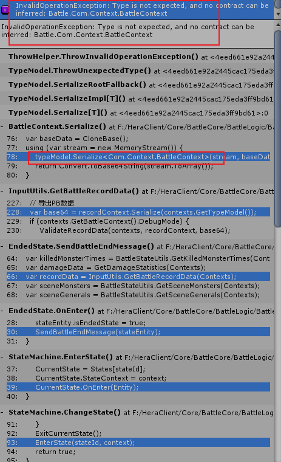
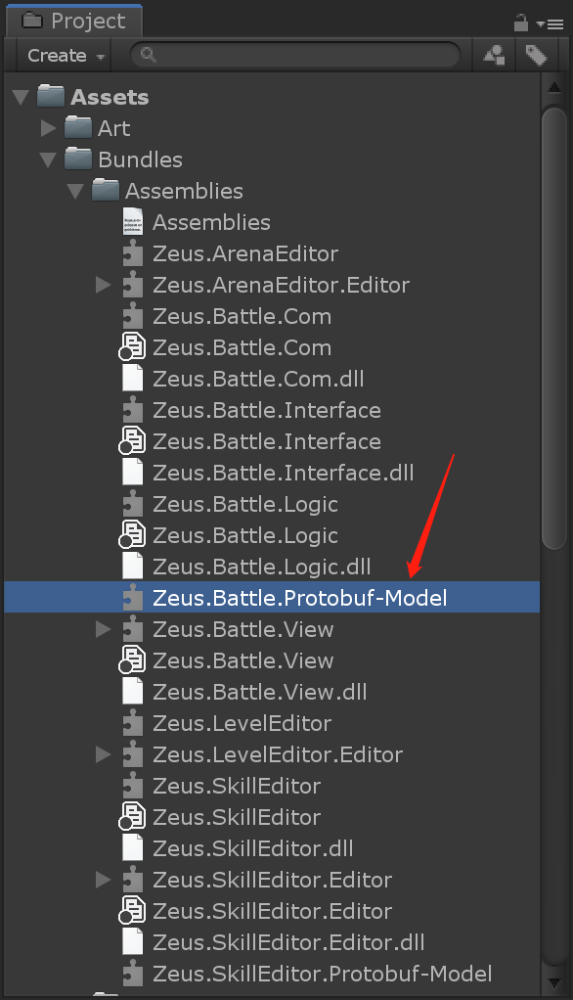
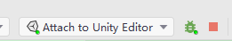
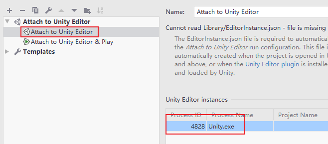
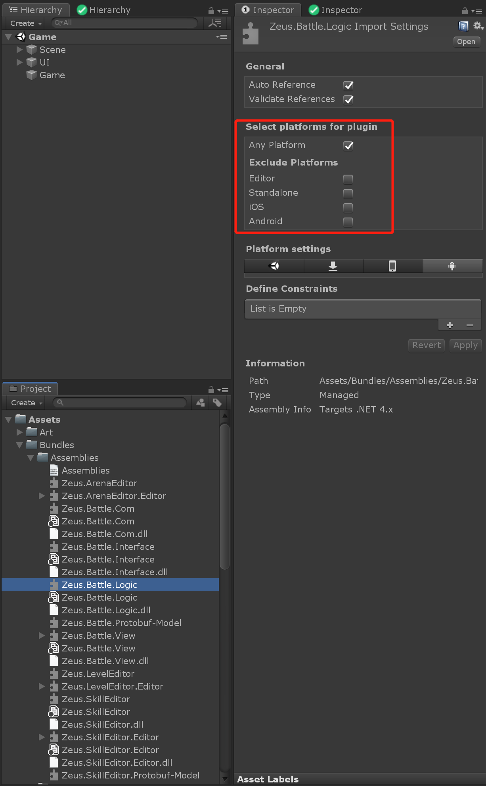
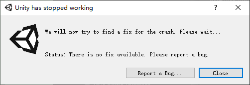
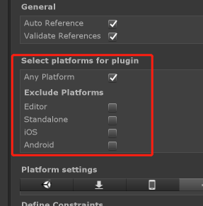
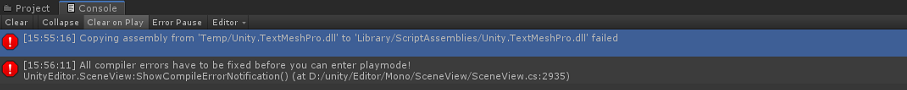
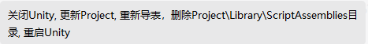

### 1.将BattleCore生成的dll导入到Unity并重新编译后，出现报错：

**解决办法：**

选中“Assemblies”文件夹，鼠标右键选择“Reimport”重新导入，此时会重新生成“Zeus.Battle.Protobuf-Model”文件

然后刷新Unity即可

### 2.BattleCore工程连接Unity开启调试后，点击“Play Mode”运行Unity，程序直接崩溃：

#### 复现步骤：

1.将BattleCore工程打出的dll导入Unity后，并“Ctrl + Shift + M”重新生成"mdb"文件：

2.在BattleCore工程连接Unity开启调试：

3.点击“Play Mode”运行Unity，Unity直接崩溃

#### 原因：

1.**使用Rider调试dll时，Rider会自动将目标dll进行锁定**

**调试方式：** 先将dll使用“ctrl + shift + M”生成dll的mdb文件后，再连接dll的源码工程与目标Unity程序id：

2.在点击“Play Mode”后，**Unity应用程序会预先检测程序运行环境，然后依次加载所需要的dll文件。**

**如果发现项目中某个dll包含当前运行平台，那么会自动加载该dll文件**

而此时又由于**该dll已经被Rider调试自动锁定，导致Unity运行环境加载失败，Unity应用程序直接崩溃**

#### 方法：

**在设置某个dll的目标平台时排除掉当前运行环境**

**这样该dll就不会集成进Unity的程序运行环境中**，此时点击"Play Mode"后Unity的程序运行环境检测正常，因此Unity可以正常启动，不会崩溃

**但问题的重点并不在于Unity中dll的集成平台**。因此如果不连接Rider调试该dll，此时无论设定dll包含哪些平台Unity都是可以正常运行的，并且游戏也可以正常运行，不会有任何异常

**主要原因在于Rider调试dll时会自动锁定住该dll以进行后续动态调试，因此这导致该dll无法被预先集成到某个程序的运行环境中，所以会在程序运行时由于无法加载该dll导致运行失败而崩溃**

### 3.部分情况下打开Unity时会报奇怪的错导致无法运行，有些时候会与dll有关

比如：

通常情况，该dll是不会报错的，但莫名奇妙的就出现了

此时常用的步骤是：

主要是删除“Library”下跟dll相关的文件。重新打开Unity后会再次重新生成，或者使用上面“鼠标右键Reimport”重新导入
