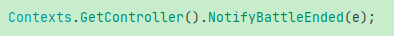

## 怒气条UI显示：

1.当计算最终怒气值后，修改对应角色LogicThingEntity的数值
2.“NotifyAngerUpdateSystem”：该system始终用于监听LogicThingEntity中包含有“AngerCurrent”
  “AngerMaximum”相关component的LogicThingEntity
  当该LogicThingEntity对应数值变化时，
  会马上触发“LogicReactiveSystem<LogicThingEntity>”的“OnExecute”
  并发送消息通知view层
  NotifyAngerUpdateSystem.cs  -》ThingAngerUpdateMessage
3.View层接收到消息后更新view层中怒气条的HudEntity：
  OnAngerUpdate ——》angerHudEntity?.ReplaceHUDAnger
4.监听所有view层怒气条entity：AssignHUDAngerSystem.cs
若怒气条实体有变化则执行“AssignHUDAngerSystem.cs”中的方法更新显示


## 角色位置Position更新：

1.使用“ReplacePosition”等方法设置Logic层中对应LogicThingEntity的position
2."NotifyThingPositionUpdatedSystem"始终会监听logic层中LogicThingEntity的位置变化
  并发送“ThingPositionMessage”通知view层
3.View层中的“OnPosition”接收到“ThingPositionMessage”消息，
  并更新view层中对应entity的position数值

**检测是否是目标component：**
NotifyThingScaleUpdatedSystem.cs:
if (!(previousComponent is ScaleComponent prevScale) || !(newComponent is ScaleComponent newScale)) {
   return;
}


### 战斗LogicController创建以及“战斗结束”的监听

#### <font color=red>**整个战斗的开始和结束使用“BattleService”控制**</font>


在**创建BattleService的方法体内部**同时<font color=red>**创建逻辑层的“BattleContext”，“LogicController”以及View层的“ViewController”，以及View层的“BattleContext”**</font>


<font color=red>**同时为“_battleLogic”添加战斗结束的委托“OnBattleEnded”**</font>

PS: **由于LogicController继承自“IBattleLogic”，因此可以直接设置LogicController中的委托“OnBattleEnded”**


#### 在开始战斗后阻塞当前协程战斗结束：

```lua
-- 阻塞当前协程，等待战斗结束
self.battleModule:WaitForBattleResult()
```


#### 在战斗结束后该“等待协程waiterThread”恢复：

1.添加监听：


2.战斗层：在战斗结束后发送“EndedState -》BattleEndedMessage”


同时Invoke委托发送战斗结束：




执行"BattleService"中的战斗结束回调：


3.<font color=red>**Lua层接收到“BattleEndedMessage”后恢复协程：**</font>


执行封装好的“Slot(self, self.OnStopped)”中的“OnStopped”方法来恢复协程


### 战斗开始流程：

使用“BattleManager”中的“StartBattle”创建BattleService后


在开场动画播放完后：


#### 1.使用事件机制通知Lua层的“EventDef.Battle.OnBattleStart”：


在Lua的“OnBattleStart”方法中向C#层的事件脚本“EventDispatcher”添加监听：


注意：这些监听是C#层的，因此如果要触发需要在C#层发送相关的消息如“BattleEventDef.OnBattleStarted”，“BattleEventDef.OnBattleEnded”


这里使用的名字与Lua中类似，但实际代表的消息却完全是C#中的“Message”系统的命名


#### 2.开始Logic层的逻辑：

```lua
self.service:Start()
```


#### 3.Lua层广播消息：  

-- TODO: Lua层广播消息是为了通知哪一层级的目标对象执行？？？？需要再研究一下

```
self:Broadcast("OnBattleStarted")
```


