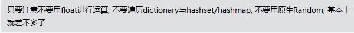
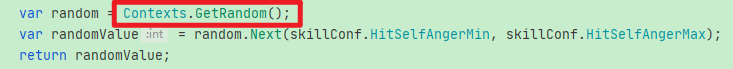
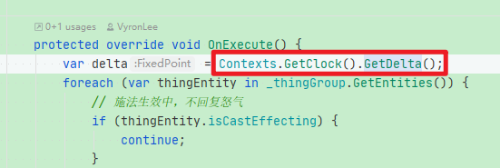

## 1.参数类型


PS: 对于确定性算法：



并非在ECS中完全禁止使用“float”类型的参数，如在设置Image.fillAmount时则可以，但不要将float参数用于计算：

```c#
//旧版PVP怒气条规则：使用image的fillAmount按照百分比显示
var value = (float) hudEntity.hUDAnger.Current / hudEntity.hUDAnger.Maximum;
var view = hudEntity.hUDView.Value;
var slider = view.transform.Find("Value").GetComponent<Image>();
slider.fillAmount = value;
```

如上虽然使用了float类型变量，但不将其用于再次运算即不会影响“确定性”


## 2.自定义方法：

### 1.Random: 

**<font color=red>创建新的Random类型“TSRandom”，以及获取随机数值的方法“Next”</font>**




### 2.获取游戏中的“Delta”时间：




