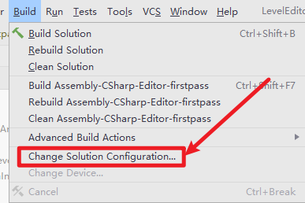
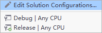

## 1.项目打dll，并将dll拷贝到指定目录：

### 步骤1：设置Rider打dll时的版本

在使用Rider为项目打dll时需要选择当前是"Release"/"Debug"版本


**设置方式**：

菜单栏“Build” ->"Change Solution Configuration"



弹出以下界面，选择对应的版本即可：




### 步骤2：将打出来的dll文件拷贝到指定目录

```c#
using System.IO;
using UnityEditor;
using UnityEngine;

namespace Plugins.Editor
{
    public class CopyDlls
    {
        private const string AssembliesFolder = "../Temp/bin/Release";

        private static readonly string[] Assemblies = {
            "Zeus.LevelEditor.dll",
            "Zeus.LevelEditor.pdb",
            "Zeus.LevelEditor.Editor.dll",
            "Zeus.LevelEditor.Editor.pdb",
            "Zeus.ArenaEditor.dll",
            "Zeus.ArenaEditor.pdb",
            "Zeus.ArenaEditor.Editor.dll",
            "Zeus.ArenaEditor.Editor.pdb",
        };

        private static readonly string[] AssembliesDestDirs = {
            "../../../Project/Assets/Bundles/Assemblies",
            "../../../Core/BattleCore/Libraries/LevelEditor",
        };

        [MenuItem("Tools/CopyDlls &d")]
        private static void CopyDllsToProject() {
            var baseDir = Application.dataPath;
            var assembliesDir = $"{baseDir}/{AssembliesFolder}";

            foreach (var fileName in Assemblies) {
                foreach (var assembliesDestDir in AssembliesDestDirs) {
                    var destDir = $"{baseDir}/{assembliesDestDir}";
                    var sourceFile = $"{assembliesDir}/{fileName}";
                    var destFile = $"{destDir}/{fileName}";
                    CopyFile(sourceFile, destFile);
                }
            }
        }
    }
}
```

