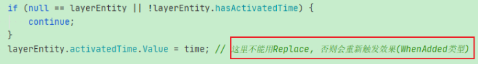
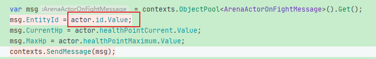
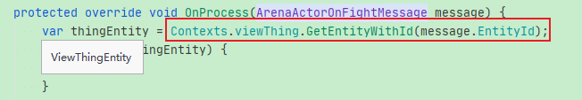
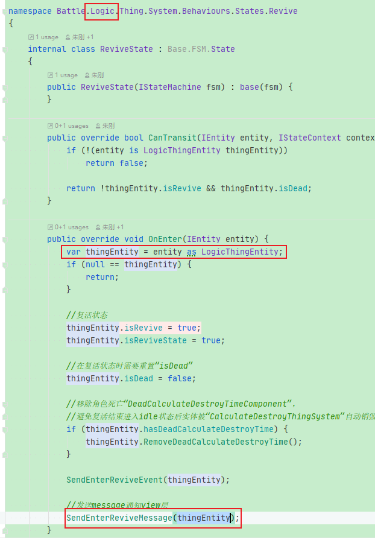
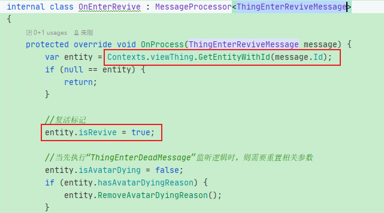
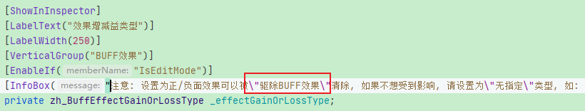
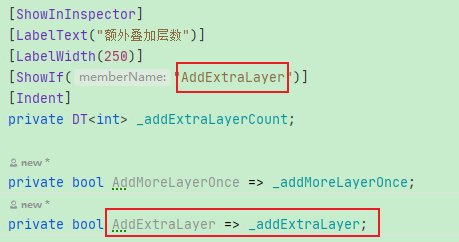
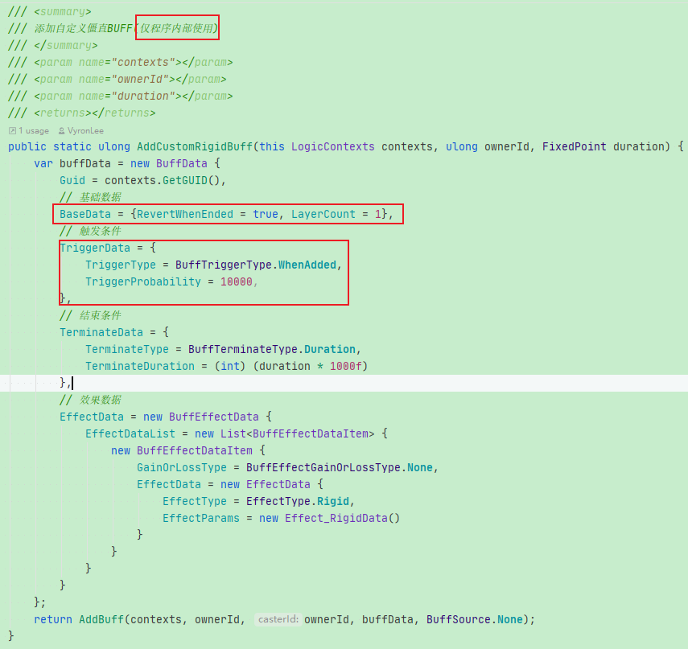

**待处理问题**：

4.Jenkins一键打包过程！！！

过程：进入文件夹目录，在地址栏输入“cmd”，即可快速在指定地址打开“命令行窗口”

Jenkins配置流程：https://blog.csdn.net/linxinfa/article/details/118816132

JDK21环境配置：https://blog.csdn.net/m0_69750058/article/details/131628553

5.HybridCLR热更：

**HybridCLR安装包git地址**(直接在PackageManager中输入即可安装HybridCLR插件)：

https://gitee.com/focus-creative-games/hybridclr_unity.git

经过实际测试，元数据中仅包含“UnityEngine.CoreModule.dll.bytes”即可正常运行，并且不需要在“HybridCLR -> Settings”中添加该元数据，只需要在加载“热更dll”前先加载“元数据Dll”即可：


**注意**：若修改了元数据则在打包前一定要先点击“HybridCLR -> Generate -> All”重新生成才可以，


如果只修改了“热更Dll”，则点击“CompileDll -> ActiveBuildTarget”即可，无需“GenerateAll”


**Dll分包策略**：https://www.jianshu.com/p/51a9a757d238


6.String字符串新的拼接方式，要看下，感觉可以节省代码

```c#
string a = "hello";
string b = @$"{a}yeah";

Debug.Log($"LoadMetadataForAOTAssembly:{aotDllName}. mode:{mode} ret:{err}")
```

7.是否真的有必要创建一个单独的“Assembly definition”文件，并设置其依赖的其他库。当时在“GameFramework框架”中使用是因为什么原因？


8.下载Android Studio中的Gradle的地址：https://services.gradle.org/distributions/

9.HybridCLR官方手册：https://hybridclr.doc.code-philosophy.com/docs/basic/com.code-philosophy.hybridclr

有些内容需要整理下，不要忘记了(手机上的“备忘录”里也写了需要整理的点)

11.项目上线部署等，可以直接使用AWS全家桶 —— 这个后面可以研究下，应该有成套的工具可以直接使用


**待处理问题**：

1.在代码中使用“git指令”上传文件：

```c#
public static void UploadVersionTemplates() {
        string versionTemplatePath = $"{Application.dataPath}/../_HotFiles/VersionTemplate/*";
        //只提交该路径下的文件，其他文件不上传
        GitRun($"add {versionTemplatePath}");
        GitRun("commit -m \"upload versionTemplates\"");
        GitRun("push -f");
}

private static void GitRun(string arguments) {
    //默认以“项目代号”作为“工作根目录”
    string workingPath = Path.GetFullPath($"{Application.dataPath}/../../../{AppFacade.AppName}/");
    if (!Directory.Exists(workingPath)) {
        LogUtil.LogError("[HotFixTool] 项目路径找不到， workingPath ：" + workingPath);
        return;
    }

    var info = new ProcessStartInfo("git", arguments) {
        CreateNoWindow = true,
        RedirectStandardOutput = true,
        UseShellExecute = false,
        WorkingDirectory = workingPath,
    };
    var process = new Process {
        StartInfo = info,
    };
    process.Start();
    string log = process.StandardOutput.ReadToEnd();
    LogUtil.Log($"<color=green>{log}</color>");
}
```

2.当需要在“双引号”内部再嵌入“双引号”时，可以使用如下的方式：

```c#
GitRun("commit -m \"upload versionTemplates\"");
```

3.相对路径：当需要设置为“当前文件夹”的“相对路径”时，可以使用“..\”的方式来获取“当前路径的上一层路径”，如：

```c#
string framePath = Path.GetFullPath(Application.dataPath + @"\..\..\..\UGameFrameMM2\");
```

4.修改代码后“主动触发编译”并“监听”编译完成：

```c#
CompilationPipeline.RequestScriptCompilation(RequestScriptCompilationOptions.CleanBuildCache);
CompilationPipeline.compilationFinished += OnCompileFinished;
```

**注意**：修改“宏配置”后触发该编译并不会使得“新的宏配置”马上生效，因此尽量不要在代码中写如下的逻辑：

```c#
public static string GetFlag() {
#if symbol1
    return "1";
#elif symbol2
    return "2";
#else
    return "3";
#endif
}
```

该逻辑在“切换宏配置”并重新编译代码后，依然不会生效，如原来的“宏”是“symbol1”，在“删除symbol1并添加symbol2并重新编译”后，调用“GetFlag()”方法依然返回“symbol1”下的数值“1”


## UI:

1.使用"assert"直接对某个参数判空？与直接使用if判空的作用区别？是否可以使用assert来简化代码逻辑？

assert是如何调用debug或其他语句将日志输出的？


5.Lua中原本引用某C#脚本的使用方式是：

```lua
local bit = require("bit")
```

但在本项目中使用的却是：

```lua
local Sprite = require "UnityEngine.Sprite"
local AppDef = class.get("AppDef")
local string = string
local typeof = typeof
```

项目对引用方式的导入做了哪些特殊处理？为什么会使用下面的方式，跟Lua原生的方式有什么区别


8.在“BattleViewConfigs.cs”中定义了跟UI相关的一些参数，如Hp血条，怒气条UI等Hud在角色头顶的显示偏移，然后在UI工程中“BattleViewConfig.json.bytes”的文件中定义了与战斗工程里“BattleViewConfigs.cs”完全相同参数名称的参数，但UI工程中为该参数设置了数值。

这样的好处就是：如果后期需要修改某些不是特别重要的关键参数时，可以直接修改UI工程中的文件，然后直接热更新即可。不需要重新编译战斗dll

这样的好处还是很多的

可以研究下这里的具体流程


11.一个将xls, xlsx表格转成lua, json, protobuf的工具：

https://github.com/VyronLee/XlsxConverter


### **优先处理：**

1.粒子系统使用“UI Particle System”可以避免与UI之间的穿插问题

2.使用soft mask可以将"UI Text Outline"裁切，普通的mask无法裁切“UI Text Outline”的内容

3.PVP场景中之前角色没有阴影，后面添加了阴影，看下怎么弄的

5.如何在Lua中使用C#中的“out”或“ref”参数的返回值：

```
local ok, pos = RectTransformUtility.ScreenPointToLocalPointInRectangle(parent.transform, screenPosition, camera3D, nil)
if ok then
    self.transform.localPosition = pos
end
```

6.AI行为树自动攻击的脚本“TryAutoCast.cs”，AI的json文件中会配置对应的行为节点的脚本文件

“Behavior3Factory.cs”中添加了各个节点，还有一个AI的表格配置文件“AttackFirstButWillChangeTarget.json”，里面配置了各个node的脚本文件名字，其中有“TryAutoCast”。这个后面再仔细看下


### 7.对于“LogicReactiveSystem”的System在触发条件的设置时：

“ThingUltimateAbilityChangedSystem.cs”

```c#
protected override ICollector<LogicThingEntity> GetTrigger(IContext<LogicThingEntity> context) {
            return context.CreateCollector(ThingMatcher.Added());
}
```

但部分情况也使用：“ThingEnterDeadSystem.cs”

```
protected override ICollector<LogicThingEntity> GetTrigger(IContext<LogicThingEntity> context) {
            return context.CreateCollector(ThingMatcher);
}
```

触发条件“ThingMatcher.Added()”与“ThingMatcher”的区别在哪？

在怒气条更新的“AssignHUDAngerSystem.cs”中使用的是“context.CreateCollector(ViewHUDMatcher.HUDAnger)”，只要怒气条改变就会触发该脚本—— 在“OnAngerUpdate.cs”中“OnProcess”会改变“angerHudEntity?.ReplaceHUDAnger(message.Current, message.Maximum)”

**解析：**

- **ThingMatcher.Added()**：用于监测目标Component的Add，但由于在ECS中“ReplaceXXXComponent”的内部逻辑是“先Remove旧的Component，然后Add新的Component”，因此依然满足“ThingMatcher.Added()”触发条件

  依据如下：

  代码片段一：

  

  代码片段二：

  

  由上可以知晓：“AddXXXComponent”和“ReplaceXXXComponent”都会导致集合条件“ThingMatcher.Added()”

- **ThingMatcher**：只需要该集合内元素值发生变化，不一定是add或remove，只要元素内某个属性值发生变化也会触发，如上述代码片段中：
  

  估计直接修改Component中的参数数值也会满足“ThingMatcher”触发条件 —— 但该猜测需要经过实际验证才可确定


## 战斗：

1.获取实体时：GetSingleEntity， GetEntities，如何能确定获取到的是单个Entity还是Entity集合？根据参数属性设置能够区分吗？

2.在“ThingSystems”中使用“Add(new InitializeCardGroupSystem(contexts)).Only(TowerDefense)”可以额外增加“Only”方法用来确定只需要在特定的模式下才需要初始化该system脚本

这个扩展的细节可以再看下，应该比较重要，如：

```lua
Add(new RevokeCardWhenGeneralDeadSystem(contexts)).Only(TowerDefense);
```


**3.很重要的地方：在Logic层创建得到的实体id**



传递到View层，居然可以直接的使用该实体id来查找对应的实体



理论上Logic层和View的实体应该是独立的，至少编号id应该是独立，这种情况下为什么可以在View层使用Logic层创建的实体id？？？？

还有一个地方可以佐证：**Logic层和View层创建的实体id，针对于General实体来讲，两者居然是共用一个实体id**

首先在Logic层发送消息Message：



**这里使用的实体为Logic层的“LogicThingEntity”，**

**然后在View层监听该Message：**



这里直接使用“Contexts.viewThing.GetEntityWithId”来获取该实体，

这说明当在Logic层创建General实体时，该id同时也被传递到了View层，因此可以同时在View层直接搜索到

这里一定要仔细看下关联过程


4.当需要在Odin编辑器的文字中使用""时可以使用 “\”右 划线来区分：



在Odin中显示“提示”可以使用“InfoBox”，那显示“严重的警告”是使用哪个方法的？


**当满足条件时才显示某些选项，可以使用“ShowIf("方法名")”：**




5.在代码中创建buff相关数据，并添加buff。实际“AddBuff”的过程也是读取配置文件中的数据或者EffectData中的buffData来添加buff，因此也可以直接在代码中声明相关的数据参数，然后直接创建buff：



和读取buff配置文件添加的buff是一样的效果


## 其他：

1.HybridCLR热更新：


